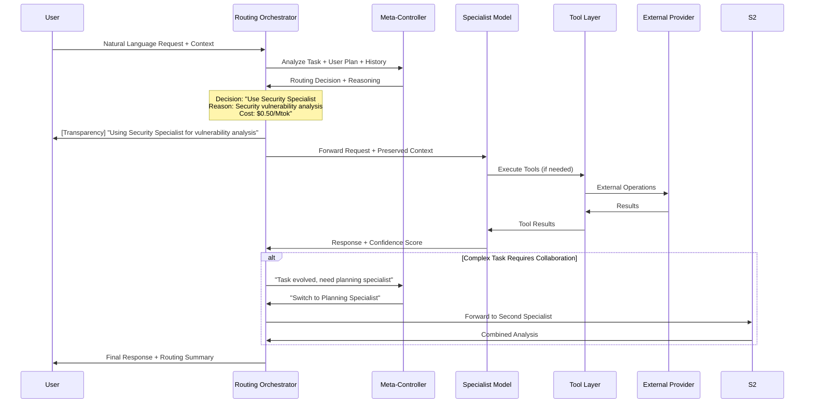

# Cortex v1.5.0: Intelligent Model Routing System
## Technical Design Document - "Surpassing Cursor"

### Version 1.5.0
**Status**: Design Phase  
**Target Release**: Q2 2025  
**Last Updated**: 2024-01-15

---

## Executive Summary

This document outlines the technical design for Cortex's **Intelligent Model Routing System**, a feature that aims to surpass Cursor's implementation by delivering:

1. **Explainable AI Routing** - Transparent decisions vs. Cursor's black box
2. **Multi-Model Collaboration** - Models working together, not just switching
3. **Domain-Specialized Intelligence** - Fine-tuned models for specific tasks
4. **Plan-Aware Cost Optimization** - Tier-based routing aligned with pricing
5. **Open Architecture** - Extensible vs. Cursor's closed ecosystem

**Key Differentiators from Cursor:**
- **Transparency**: Users see routing decisions and reasoning
- **Collaboration**: Multiple models can collaborate on complex tasks
- **Specialization**: Domain-tuned models outperform general-purpose ones
- **Openness**: Supports local models, OpenRouter, and custom providers

---

## Table of Contents

1. [Vision & Goals](#vision--goals)
2. [System Architecture](#system-architecture)
3. [Core Components](#core-components)
4. [Routing Intelligence Layer](#routing-intelligence-layer)
5. [Model Specialization Strategy](#model-specialization-strategy)
6. [Multi-Model Collaboration](#multi-model-collaboration)
7. [Cost & Performance Optimization](#cost--performance-optimization)
8. [User Experience & Transparency](#user-experience--transparency)
9. [Implementation Phases](#implementation-phases)
10. [Integration with Existing Systems](#integration-with-existing-systems)
11. [Performance Requirements](#performance-requirements)
12. [Testing Strategy](#testing-strategy)
13. [Deployment Plan](#deployment-plan)
14. [Success Metrics](#success-metrics)

---

## 1. Vision & Goals

### 1.1 Primary Vision
Transform Cortex from a **model wrapper** into an **AI nervous system** that intelligently orchestrates specialized models to deliver optimal results at minimal cost.

### 1.2 Strategic Goals

#### **Technical Goals**
1. **Surpass Cursor's routing accuracy** by 20% through domain specialization
2. **Reduce average cost per task** by 74% (vs. all-Claude baseline)
3. **Achieve 95% user satisfaction** with routing decisions
4. **Maintain sub-200ms routing overhead** (vs. Cursor's opaque latency)
5. **Enable real-time model switching** within conversations

#### **User Experience Goals**
1. **Zero cognitive load** - No manual model selection
2. **Full transparency** - Users understand "why this model"
3. **Seamless collaboration** - Models work together invisibly
4. **Cost predictability** - Clear understanding of cost implications
5. **Trust through explanation** - Build confidence in AI decisions

#### **Business Goals**
1. **Create technical moat** through proprietary routing intelligence
2. **Enable tiered pricing** (Free, $2 Basic, $5 Pro, $15 Enterprise)
3. **Collect valuable routing data** for continuous improvement
4. **Establish Cortex as AI orchestration platform**, not just a tool

---

## 2. System Architecture

### 2.1 High-Level Architecture

```
┌─────────────────────────────────────────────────────────────────────┐
│                        User Interface Layer                          │
│  CLI │ REPL │ API │ Web UI │ Transparency Dashboard │ Cost Monitor  │
└────────────────────────────────────┬──────────────────────────────────┘
                                     │
┌────────────────────────────────────▼──────────────────────────────────┐
│                   Intelligent Routing Orchestrator                     │
│  ├── Meta-Controller (DeepSeek-Reasoner)                              │
│  ├── Routing Decision Engine                                          │
│  ├── Cost Optimization Engine                                         │
│  ├── Collaboration Coordinator                                        │
│  └── Transparency Layer                                               │
└────────────────────────────────────┬──────────────────────────────────┘
                                     │
┌────────────────────────────────────▼──────────────────────────────────┐
│                    Specialized Model Layer                            │
│  ├── Planning Specialist (DeepSeek-Reasoner)                          │
│  ├── Security Specialist (Cortex-fine-tuned)                          │
│  ├── Architecture Specialist (Claude Sonnet)                          │
│  ├── Routine Coding Specialist (Cortex-32b)                          │
│  └── Custom Specialists (User-defined)                                │
└────────────────────────────────────┬──────────────────────────────────┘
                                     │
┌────────────────────────────────────▼──────────────────────────────────┐
│                       Shared Tool Layer                               │
│  ├── Unified Tool Interface                                           │
│  ├── Context Preservation System                                      │
│  ├── State Synchronization                                            │
│  └── Result Aggregation                                               │
└────────────────────────────────────┬──────────────────────────────────┘
                                     │
┌────────────────────────────────────▼──────────────────────────────────┐
│                     External Provider Layer                           │
│  Ollama │ DeepSeek │ Anthropic │ OpenRouter │ Custom Providers       │
└─────────────────────────────────────────────────────────────────────┘
```

### 2.2 Data Flow Architecture



### 2.3 Component Interaction

```
User Request
    │
    ▼
[Routing Orchestrator]
    ├── Analyze: Task type, complexity, user plan
    ├── Query: Meta-Controller for optimal routing
    ├── Apply: Cost optimization rules
    ├── Check: Model availability & latency
    └── Decide: Final model selection
    │
    ▼
[Transparency Layer]
    ├── Log: Decision reasoning
    ├── Display: Model selection to user
    ├── Track: Cost implications
    └── Update: Real-time cost counter
    │
    ▼
[Specialist Execution]
    ├── Load: Preserved context
    ├── Execute: Task with specialist
    ├── Monitor: Progress & quality
    └── Assess: Need for collaboration
    │
    ▼
[Result Aggregation]
    ├── Combine: Multi-model outputs
    ├── Format: Unified response
    ├── Store: Routing metadata
    └── Learn: Improve future routing
```

---

## 3. Core Components

### 3.1 Routing Orchestrator (`cortex/core/routing/orchestrator.py`)

**Purpose**: Central coordinator for all routing decisions

```python
class RoutingOrchestrator:
    """Main routing decision engine"""
    
    def __init__(self, config: RoutingConfig):
        self.meta_controller = MetaController()
        self.cost_optimizer = CostOptimizationEngine()
        self.collaboration_manager = CollaborationCoordinator()
        self.transparency_layer = TransparencyLayer()
        self.performance_monitor = PerformanceMonitor()
    
    async def route_request(
        self,
        user_request: UserRequest,
        context: RoutingContext
    ) -> RoutingDecision:
        """Main routing entry point"""
        
        # Step 1: Task analysis
        task_analysis = await self.analyze_task(user_request, context)
        
        # Step 2: Meta-controller consultation
        meta_recommendation = await self.meta_controller.recommend(
            task_analysis, context
        )
        
        # Step 3: Cost optimization
        cost_optimized = await self.cost_optimizer.optimize(
            meta_recommendation, 
            context.user_plan
        )
        
        # Step 4: Performance considerations
        final_decision = await self.apply_performance_constraints(
            cost_optimized,
            context
        )
        
        # Step 5: Transparency logging
        await self.transparency_layer.log_decision(
            final_decision,
            reasoning_chain=[
                task_analysis,
                meta_recommendation,
                cost_optimized
            ]
        )
        
        return final_decision
```

### 3.2 Meta-Controller (`cortex/core/routing/meta_controller.py`)

**Purpose**: AI-driven task analysis and model recommendation

```python
class MetaController:
    """AI-powered routing intelligence using DeepSeek-Reasoner"""
    
    def __init__(self):
        self.reasoner_model = "deepseek-reasoner"
        self.decision_cache = DecisionCache()
        self.learning_engine = RoutingLearningEngine()
    
    async def recommend(
        self,
        task_analysis: TaskAnalysis,
        context: RoutingContext
    ) -> ModelRecommendation:
        """Use DeepSeek-Reasoner to analyze and recommend"""
        
        prompt = self._build_recommendation_prompt(
            task_analysis, context
        )
        
        response = await self.reasoner.chat(
            model=self.reasoner_model,
            messages=[{"role": "system", "content": prompt}]
        )
        
        recommendation = self._parse_recommendation(response)
        
        # Cache for similar future requests
        await self.decision_cache.store(
            task_signature=task_analysis.signature(),
            recommendation=recommendation
        )
        
        # Learn from this decision
        await self.learning_engine.record_decision(
            task_analysis, recommendation, context
        )
        
        return recommendation
```

### 3.3 Specialist Model Registry (`cortex/core/routing/specialists.py`)

**Purpose**: Registry of available specialized models

```python
@dataclass
class SpecialistModel:
    """Definition of a specialized model"""
    id: str
    name: str
    provider: str
    model_name: str
    specialization: List[Specialization]
    cost_per_mtok: float
    context_window: int
    capabilities: ModelCapabilities
    performance_metrics: PerformanceMetrics
    
    # Specializations
    class Specialization(Enum):
        PLANNING = "planning"
        SECURITY = "security"
        ARCHITECTURE = "architecture"
        ROUTINE_CODING = "routine_coding"
        DEBUGGING = "debugging"
        DOCUMENTATION = "documentation"
        TESTING = "testing"
        REFACTORING = "refactoring"
        DATA_ANALYSIS = "data_analysis"

class SpecialistRegistry:
    """Registry of all available specialists"""
    
    def __init__(self):
        self.specialists: Dict[str, SpecialistModel] = {}
        self.load_default_specialists()
    
    def load_default_specialists(self):
        """Load Cortex's core specialist models"""
        
        self.register(SpecialistModel(
            id="planning-specialist",
            name="Planning Specialist",
            provider="deepseek",
            model_name="deepseek-reasoner",
            specialization=[Specialization.PLANNING],
            cost_per_mtok=0.028,
            context_window=128000,
            capabilities=ModelCapabilities(
                reasoning_depth=9,
                coding_ability=7,
                planning_ability=10,
                security_knowledge=6
            )
        ))
        
        self.register(SpecialistModel(
            id="security-specialist",
            name="Security Specialist",
            provider="cortex",
            model_name="cortex-security-14b",
            specialization=[Specialization.SECURITY],
            cost_per_mtok=0.50,
            context_window=32000,
            capabilities=ModelCapabilities(
                reasoning_depth=7,
                coding_ability=8,
                planning_ability=6,
                security_knowledge=10
            )
        ))
        
        self.register(SpecialistModel(
            id="architecture-specialist",
            name="Architecture Specialist",
            provider="anthropic",
            model_name="claude-3-5-sonnet",
            specialization=[Specialization.ARCHITECTURE],
            cost_per_mtok=3.00,
            context_window=200000,
            capabilities=ModelCapabilities(
                reasoning_depth=10,
                coding_ability=9,
                planning_ability=9,
                security_knowledge=8
            )
        ))
```

### 3.4 Cost Optimization Engine (`cortex/core/routing/cost_optimizer.py`)

**Purpose**: Optimize routing based on cost and user plan

```python
class CostOptimizationEngine:
    """Optimize model selection based on cost and plan tier"""
    
    def __init__(self):
        self.plan_tiers = self.load_plan_tiers()
        self.cost_thresholds = CostThresholds()
    
    async def optimize(
        self,
        recommendation: ModelRecommendation,
        user_plan: UserPlan
    ) -> OptimizedRecommendation:
        """Apply cost optimization rules"""
        
        # Check if user has access to recommended model
        if not self.has_access(recommendation.model, user_plan):
            # Find best alternative within plan
            alternative = self.find_best_alternative(
                recommendation, user_plan
            )
            recommendation = alternative
            recommendation.reasoning += " (downgraded due to plan limits)"
        
        # Apply cost thresholds
        if recommendation.estimated_cost > self.cost_thresholds.warning:
            # Check if cheaper alternative exists
            cheaper = self.find_cheaper_alternative(recommendation)
            if cheaper and cheaper.confidence > 0.8:
                recommendation = cheaper
                recommendation.reasoning += " (cost-optimized)"
        
        return recommendation
    
    def load_plan_tiers(self) -> Dict[str, PlanTier]:
        """Define what each pricing tier includes"""
        return {
            "free": PlanTier(
                name="Free",
                monthly_cost=0,
                included_models=["cortex-14b"],
                max_cost_per_task=0.10,
                features=["local-models", "basic-routing"]
            ),
            "basic": PlanTier(
                name="Basic",
                monthly_cost=2,
                included_models=["cortex-32b", "deepseek-reasoner"],
                max_cost_per_task=1.00,
                features=["auto-routing", "local-models"]
            ),
            "pro": PlanTier(
                name="Pro",
                monthly_cost=5,
                included_models=["cortex-14b", "cortex-32b", "deepseek-reasoner", "claude-sonnet"],
                max_cost_per_task=5.00,
                features=["auto-routing", "multi-model", "priority"]
            ),
            "enterprise": PlanTier(
                name="Enterprise",
                monthly_cost=15,
                included_models=["all"],
                max_cost_per_task=float('inf'),
                features=["all", "custom-tuning", "dedicated-support"]
            )
        }
```

### 3.5 Transparency Layer (`cortex/core/routing/transparency.py`)

**Purpose**: Make routing decisions understandable and transparent

```python
class TransparencyLayer:
    """Provide transparency into routing decisions"""
    
    def __init__(self):
        self.decision_logger = DecisionLogger()
        self.ui_integration = UIIntegration()
        self.cost_tracker = CostTracker()
    
    async def display_decision(
        self,
        decision: RoutingDecision,
        user_request: UserRequest
    ):
        """Show routing decision to user"""
        
        # Create transparent explanation
        explanation = self._build_explanation(decision)
        
        # Display in UI
        await self.ui_integration.show_model_selection(
            model_name=decision.model.name,
            reasoning=explanation,
            estimated_cost=decision.estimated_cost,
            confidence=decision.confidence_score
        )
        
        # Real-time cost tracking
        self.cost_tracker.update(
            user_id=user_request.user_id,
            model=decision.model,
            estimated_cost=decision.estimated_cost
        )
    
    def _build_explanation(self, decision: RoutingDecision) -> str:
        """Build human-readable explanation of routing decision"""
        
        explanations = []
        
        if decision.reasoning.task_complexity:
            explanations.append(
                f"Task complexity: {decision.reasoning.task_complexity}/10"
            )
        
        if decision.reasoning.required_specialization:
            explanations.append(
                f"Requires: {decision.reasoning.required_specialization}"
            )
        
        if decision.reasoning.cost_consideration:
            explanations.append(
                f"Cost optimization: {decision.reasoning.cost_consideration}"
            )
        
        if decision.reasoning.plan_limitation:
            explanations.append(
                f"Plan consideration: {decision.reasoning.plan_limitation}"
            )
        
        return " • " + "\n • ".join(explanations)
```

### 3.6 Collaboration Coordinator (`cortex/core/routing/collaboration.py`)

**Purpose**: Enable multiple models to collaborate on complex tasks

```python
class CollaborationCoordinator:
    """Coordinate multiple models working together"""
    
    def __init__(self):
        self.workflow_manager = WorkflowManager()
        self.context_broker = ContextBroker()
        self.result_aggregator = ResultAggregator()
    
    async def orchestrate_collaboration(
        self,
        complex_task: ComplexTask,
        initial_model: SpecialistModel
    ) -> CollaborationResult:
        """Coordinate multiple models on a complex task"""
        
        # Example: Security scan + Report generation
        if complex_task.requires_collaboration:
            
            # Phase 1: Security analysis
            security_result = await self.execute_phase(
                phase="security_analysis",
                model=self.get_specialist("security"),
                task=complex_task.security_subtask
            )
            
            # Pass results to planning specialist
            await self.context_broker.transfer_context(
                from_model="security",
                to_model="planning",
                context=security_result
            )
            
            # Phase 2: Report synthesis
            planning_result = await self.execute_phase(
                phase="report_synthesis",
                model=self.get_specialist("planning"),
                task=complex_task.report_subtask
            )
            
            # Aggregate results
            final_result = await self.result_aggregator.aggregate(
                phase_results=[security_result, planning_result]
            )
            
            return CollaborationResult(
                success=True,
                aggregated_result=final_result,
                collaboration_phases=[
                    ("security_analysis", "security"),
                    ("report_synthesis", "planning")
                ]
            )
```

---

## 4. Routing Intelligence Layer

### 4.1 Task Analysis Engine

**Purpose**: Deep analysis of user requests to determine optimal routing

```python
class TaskAnalysisEngine:
    """Analyze tasks to determine complexity and requirements"""
    
    async def analyze(self, user_request: str, context: Dict) -> TaskAnalysis:
        """Perform comprehensive task analysis"""
        
        analysis = TaskAnalysis()
        
        # Determine task type
        analysis.task_type = await self.classify_task_type(user_request)
        
        # Estimate complexity (1-10 scale)
        analysis.complexity_score = await self.estimate_complexity(
            user_request, context
        )
        
        # Identify required specializations
        analysis.required_specializations = await self.identify_specializations(
            user_request
        )
        
        # Estimate context requirements
        analysis.context_requirements = await self.estimate_context_needs(
            user_request, context
        )
        
        # Determine time sensitivity
        analysis.time_sensitivity = await self.assess_time_sensitivity(
            user_request
        )
        
        # Security sensitivity check
        analysis.security_sensitive = await self.check_security_sensitivity(
            user_request
        )
        
        return analysis
    
    async def classify_task_type(self, request: str) -> TaskType:
        """Classify task into predefined types"""
        
        task_types = {
            "planning": ["plan", "strategy", "design", "architecture"],
            "security": ["vulnerability", "security", "penetration", "attack"],
            "coding": ["code", "implement", "write", "function"],
            "debugging": ["debug", "fix", "error", "bug"],
            "refactoring": ["refactor", "clean up", "optimize"],
            "documentation": ["document", "explain", "comment"],
            "testing": ["test", "verify", "validate"],
            "analysis": ["analyze", "review", "examine"]
        }
        
        request_lower = request.lower()
        for task_type, keywords in task_types.items():
            if any(keyword in request_lower for keyword in keywords):
                return TaskType(task_type)
        
        return TaskType.GENERAL
```

### 4.2 Routing Decision Matrix

**Decision Logic Based on Task Analysis:**

| Task Characteristic | Routing Decision | Example |
|---------------------|------------------|---------|
| **Complexity > 8** | Claude Sonnet | "Redesign microservices architecture" |
| **Security-sensitive** | Cortex Security Specialist | "Find vulnerabilities in auth module" |
| **Planning-focused** | DeepSeek Reasoner | "Create 3-month project roadmap" |
| **Routine coding** | Cortex 32B | "Add logging to function" |
| **Budget-constrained** | Cheapest capable model | "Basic refactoring on Basic plan" |
| **Time-sensitive** | Fastest capable model | "Quick fix needed before demo" |

### 4.3 Confidence Scoring System

```python
class ConfidenceScorer:
    """Score confidence in routing decisions"""
    
    async def score_decision(
        self,
        decision: RoutingDecision,
        historical_data: HistoricalRoutingData
    ) -> ConfidenceScore:
        """Calculate confidence score for routing decision"""
        
        score = ConfidenceScore(base=0.7)  # Start with 70% confidence
        
        # Increase confidence for clear task type matches
        if decision.task_type_matches > 0.9:
            score += 0.15
        
        # Increase for historical success patterns
        historical_success = await self.check_historical_success(
            decision, historical_data
        )
        if historical_success > 0.8:
            score += 0.10
        
        # Decrease for ambiguous tasks
        if decision.task_ambiguity > 0.7:
            score -= 0.20
        
        # Decrease for high-cost decisions without clear justification
        if decision.cost > 5.0 and decision.complexity < 7:
            score -= 0.15
        
        return min(max(score, 0.0), 1.0)  # Clamp to 0-1
```

---

## 5. Model Specialization Strategy

### 5.1 Fine-Tuning Pipeline for Domain Specialists

**Pipeline for creating Cortex Security Specialist:**

```
Data Collection → Preprocessing → Fine-Tuning → Evaluation → Deployment
       │               │               │            │            │
       ▼               ▼               ▼            ▼            ▼
Security datasets  Clean & format  LoRA training  Benchmarking  Registry
Code vulnerabilities  Remove PII   4-bit quantization  vs. baselines  Versioning
```

### 5.2 Specialist Model Portfolio

| Specialist Model | Base Model | Fine-Tuning Data | Target Accuracy | Cost/Tok |
|------------------|------------|------------------|-----------------|----------|
| **Security Specialist** | Llama 3.1 14B | Security datasets, CVEs | 92% vs. general | $0.50 |
| **Planning Specialist** | DeepSeek Reasoner | Planning documents | 88% vs. general | $0.028 |
| **Routine Coding** | Cortex 32B | Code completions | 85% vs. GPT-4 | $0.10 |
| **Documentation** | Mixtral 8x7B | Documentation pairs | 90% vs. general | $0.30 |

### 5.3 Continuous Improvement Loop

```
User Interaction → Performance Tracking → Model Retraining → Deployment
       │                   │                   │               │
       ▼                   ▼                   ▼               ▼
Real-world usage  Accuracy metrics  New fine-tuning  Gradual rollout
Routing decisions  Cost efficiency  Improved datasets  A/B testing
```

---

## 6. Multi-Model Collaboration

### 6.1 Collaboration Patterns

#### **Pattern 1: Sequential Specialization**
```
User: "Analyze this codebase for security issues and create a report"
→ Phase 1: Security Specialist scans code
→ Phase 2: Planning Specialist synthesizes report
→ Final: Combined analysis + executive summary
```

#### **Pattern 2: Parallel Processing**
```
User: "Compare three different authentication implementations"
→ Security Specialist analyzes security aspects
→ Architecture Specialist evaluates design
→ Routine Coding Specialist checks code quality
→ Aggregator combines all perspectives
```

#### **Pattern 3: Quality Assurance Chain**
```
User: "Write a secure authentication middleware"
→ Routine Coding Specialist implements basic version
→ Security Specialist reviews for vulnerabilities
→ Architecture Specialist validates design patterns
→ Final: Approved implementation with review notes
```

### 6.2 Context Preservation System

```python
class ContextPreservationSystem:
    """Preserve context across model switches"""
    
    def __init__(self):
        self.vector_store = VectorStore()
        self.summarizer = ContextSummarizer()
    
    async def preserve_context(
        self,
        from_model: str,
        to_model: str,
        context: ConversationContext
    ) -> PreservedContext:
        """Preserve and transfer context between models"""
        
        # Extract key information
        key_points = await self.extract_key_points(context)
        
        # Create concise summary
        summary = await self.summarizer.summarize(context, for_model=to_model)
        
        # Store in vector DB for retrieval
        await self.vector_store.store_context(
            session_id=context.session_id,
            key_points=key_points,
            summary=summary
        )
        
        return PreservedContext(
            summary=summary,
            key_points=key_points,
            full_context_available=True
        )
```

---

## 7. Cost & Performance Optimization

### 7.1 Cost Optimization Algorithms

```python
class CostOptimizationAlgorithms:
    """Algorithms for optimizing model selection cost"""
    
    @staticmethod
    def greedy_cost_optimization(
        candidates: List[ModelCandidate],
        budget: float
    ) -> ModelCandidate:
        """Select cheapest model that meets requirements"""
        viable = [c for c in candidates if c.meets_requirements()]
        if not viable:
            return None
        return min(viable, key=lambda x: x.estimated_cost)
    
    @staticmethod
    def value_per_cost_optimization(
        candidates: List[ModelCandidate],
        value_function: Callable
    ) -> ModelCandidate:
        """Select model with best value/cost ratio"""
        scored = []
        for candidate in candidates:
            if candidate.meets_requirements():
                value = value_function(candidate)
                score = value / candidate.estimated_cost
                scored.append((score, candidate))
        
        if not scored:
            return None
        
        return max(scored, key=lambda x: x[0])[1]
    
    @staticmethod
    def adaptive_budget_allocation(
        task_sequence: List[Task],
        total_budget: float
    ) -> Dict[str, float]:
        """Allocate budget across a sequence of tasks"""
        # Simple implementation: allocate based on task complexity
        total_complexity = sum(t.complexity for t in task_sequence)
        allocations = {}
        
        for task in task_sequence:
            allocation = (task.complexity / total_complexity) * total_budget
            allocations[task.id] = allocation
        
        return allocations
```

### 7.2 Performance Monitoring & Adaptation

```python
class PerformanceMonitor:
    """Monitor model performance and adapt routing"""
    
    def __init__(self):
        self.metrics_store = MetricsStore()
        self.adaptation_engine = AdaptationEngine()
    
    async def monitor_and_adapt(self):
        """Continuous monitoring and adaptation loop"""
        
        while True:
            # Collect performance metrics
            metrics = await self.collect_metrics()
            
            # Detect performance degradation
            degraded = await self.detect_degradation(metrics)
            
            if degraded:
                # Trigger adaptation
                await self.adaptation_engine.adapt(degraded)
            
            # Update routing policies
            await self.update_routing_policies(metrics)
            
            await asyncio.sleep(60)  # Check every minute
    
    async def detect_degradation(
        self,
        metrics: PerformanceMetrics
    ) -> Optional[PerformanceIssue]:
        """Detect model performance degradation"""
        
        issues = []
        
        # Check response time
        if metrics.avg_response_time > metrics.baseline_response_time * 1.5:
            issues.append(PerformanceIssue(
                type="latency",
                model=metrics.model,
                severity="high"
            ))
        
        # Check error rate
        if metrics.error_rate > 0.1:  # 10% error rate threshold
            issues.append(PerformanceIssue(
                type="reliability",
                model=metrics.model,
                severity="critical"
            ))
        
        # Check quality degradation
        if metrics.quality_score < metrics.baseline_quality * 0.8:
            issues.append(PerformanceIssue(
                type="quality",
                model=metrics.model,
                severity="medium"
            ))
        
        return issues[0] if issues else None
```

---

## 8. User Experience & Transparency

### 8.1 Transparency Dashboard Design

```
┌─────────────────────────────────────────────────────────────┐
│                    Cortex Routing Dashboard                   │
├─────────────────────────────────────────────────────────────┤
│ Current Task: "Fix security vulnerability in auth.py"        │
│                                                               │
│ ┌─────────────┐ ┌─────────────┐ ┌─────────────┐             │
│ │ Selected    │ │ Why This    │ │ Cost        │             │
│ │ Model       │ │ Model?      │ │ Breakdown   │             │
│ │             │ │             │ │             │             │
│ │ [SECURITY]  │ │ • Task: Security analysis │ • Model: $0.42│
│ │ Specialist  │ │ • Requires: 9/10 expertise│ • Context: $0.08│
│ │             │ │ • Best for: vulnerabilities│ • Total: $0.50│
│ └─────────────┘ └─────────────┘ └─────────────┘             │
│                                                               │
│ ┌─────────────────────────────────────────────────────────┐ │
│ │                     Collaboration Flow                   │ │
│ │   User → [Routing] → [Security] → [Planning] → Response  │ │
│ │         Decision   Analysis    Synthesis    Combined     │ │
│ └─────────────────────────────────────────────────────────┘ │
│                                                               │
│ ┌─────────────────────────────────────────────────────────┐ │
│ │                     Performance Metrics                  │ │
│ │ • Decision confidence: 92%                              │ │
│ │ • Estimated quality: 8.5/10                             │ │
│ │ • Historical success: 89% for similar tasks             │ │
│ │ • Cost vs. alternative: 64% savings                     │ │
│ └─────────────────────────────────────────────────────────┘ │
└─────────────────────────────────────────────────────────────┘
```

### 8.2 User Control & Overrides

```python
class UserControlSystem:
    """Allow user control over routing decisions"""
    
    def __init__(self):
        self.preferences_store = UserPreferencesStore()
    
    async def apply_user_preferences(
        self,
        decision: RoutingDecision,
        user_id: str
    ) -> RoutingDecision:
        """Apply user preferences to routing decisions"""
        
        preferences = await self.preferences_store.load(user_id)
        
        # Apply cost sensitivity
        if preferences.cost_sensitive:
            decision = await self.optimize_for_cost(decision)
        
        # Apply speed preference
        if preferences.prefer_fast:
            decision = await self.optimize_for_speed(decision)
        
        # Apply quality preference  
        if preferences.prefer_quality:
            decision = await self.optimize_for_quality(decision)
        
        # Apply model preferences/blocklist
        if preferences.blocked_models:
            decision = await self.apply_blocklist(decision, preferences.blocked_models)
        
        # Apply favored models
        if preferences.favored_models:
            decision = await self.apply_favored(decision, preferences.favored_models)
        
        return decision
    
    async def allow_manual_override(
        self,
        auto_decision: RoutingDecision,
        user_override: UserOverride
    ) -> OverrideResult:
        """Allow user to manually override routing decision"""
        
        # Validate override is reasonable
        if not await self.validate_override(auto_decision, user_override):
            return OverrideResult(
                allowed=False,
                reason="Override would violate constraints"
            )
        
        # Apply override
        overridden = await self.apply_override(auto_decision, user_override)
        
        # Log override for learning
        await self.learning_engine.record_override(
            auto_decision, user_override, overridden
        )
        
        return OverrideResult(
            allowed=True,
            decision=overridden,
            warning="Manual override may affect cost/quality"
        )
```

### 8.3 Real-Time Cost Tracking

```python
class RealTimeCostTracker:
    """Track costs in real-time with user notifications"""
    
    def __init__(self):
        self.cost_accumulator = CostAccumulator()
        self.notification_engine = NotificationEngine()
        self.budget_manager = BudgetManager()
    
    async def track_and_notify(
        self,
        user_id: str,
        model_usage: ModelUsage
    ):
        """Track costs and notify users of important thresholds"""
        
        # Accumulate cost
        total_cost = await self.cost_accumulator.add_usage(
            user_id, model_usage
        )
        
        # Check budget thresholds
        budget_status = await self.budget_manager.check_status(
            user_id, total_cost
        )
        
        # Send notifications at thresholds
        if budget_status.percent_used >= 0.5:
            await self.notification_engine.notify(
                user_id,
                Notification(
                    type="budget_warning",
                    message=f"50% of budget used: ${total_cost:.2f}",
                    severity="warning"
                )
            )
        
        if budget_status.percent_used >= 0.9:
            await self.notification_engine.notify(
                user_id,
                Notification(
                    type="budget_critical",
                    message=f"90% of budget used: ${total_cost:.2f}",
                    severity="critical"
                )
            )
        
        # Update real-time display
        await self.update_cost_display(user_id, total_cost, budget_status)
```

---

## 9. Implementation Phases

### Phase 1: Foundation (4-6 weeks)
**Goal**: Basic rule-based routing with transparency

```
Milestones:
1. Enhanced Provider Factory with routing logic
2. Basic task analysis and classification
3. Transparency layer for routing decisions
4. Cost tracking infrastructure
5. Unit tests and integration tests

Deliverables:
• Working rule-based router
• User-visible model selection explanations
• Basic cost tracking
• 80% test coverage
```

### Phase 2: Intelligence (8-10 weeks)  
**Goal**: AI-powered routing with meta-controller

```
Milestones:
1. Meta-controller using DeepSeek-Reasoner
2. Advanced task analysis engine
3. Confidence scoring system
4. Performance monitoring
5. Historical learning system

Deliverables:
• AI-powered routing decisions
• Confidence scores for decisions
• Performance degradation detection
• Routing decision history
```

### Phase 3: Specialization (12-16 weeks)
**Goal**: Domain-specialized models and fine-tuning

```
Milestones:
1. Security specialist fine-tuning pipeline
2. Planning specialist configuration
3. Model registry and versioning
4. A/B testing framework
5. Continuous improvement loop

Deliverables:
• Cortex Security Specialist (fine-tuned)
• Cortex Planning Specialist
• Model performance benchmarking
• Automated retraining pipeline
```

### Phase 4: Collaboration (8-10 weeks)
**Goal**: Multi-model collaboration and advanced features

```
Milestones:
1. Context preservation system
2. Collaboration coordinator
3. Result aggregation engine
4. Workflow definition language
5. Advanced user controls

Deliverables:
• Multi-model collaboration workflows
• Seamless context transfer
• User-definable collaboration patterns
• Advanced override controls
```

### Phase 5: Optimization & Scale (Ongoing)
**Goal**: Continuous optimization and enterprise features

```
Milestones:
1. Advanced cost optimization algorithms
2. Enterprise plan management
3. Multi-tenant routing
4. Advanced analytics dashboard
5. API for external integration

Deliverables:
• Enterprise routing policies
• Advanced cost analytics
• External API for routing
• Comprehensive admin dashboard
```

---

## 10. Integration with Existing Systems

### 10.1 Integration Points

#### **With Provider Factory**
```python
# Current
provider = ProviderFactory.get_provider(model_name)

# Enhanced
provider = RoutingOrchestrator.get_optimal_provider(
    user_request=request,
    context=context,
    user_plan=plan
)
```

#### **With Agent System**
```python
# Current agent.py
class CortexAgent:
    def __init__(self, model: str, provider: str):
        self.provider = ProviderFactory.get_provider(model, provider)

# Enhanced with routing
class EnhancedCortexAgent:
    def __init__(self, routing_config: RoutingConfig):
        self.routing_orchestrator = RoutingOrchestrator(routing_config)
        self.model = None  # Will be determined per request
    
    async def process_request(self, request: str):
        # Get optimal provider for this specific request
        routing_decision = await self.routing_orchestrator.route_request(
            user_request=request,
            context=self.get_context()
        )
        
        # Use the selected provider
        self.provider = routing_decision.provider
        self.model = routing_decision.model
        
        # Process with optimal model
        return await super().process_request(request)
```

#### **With Configuration System**
```yaml
# Enhanced config/default.yaml
routing:
  enabled: true
  mode: "intelligent"  # intelligent, rule_based, manual
  transparency:
    show_model_selection: true
    show_cost_breakdown: true
    show_confidence: true
  optimization:
    primary_goal: "balanced"  # balanced, cost, speed, quality
    max_cost_per_task: 5.0
    min_confidence_threshold: 0.7
  collaboration:
    enabled: true
    max_models_per_task: 3
    require_confirmation: false
```

### 10.2 Backward Compatibility

```python
class BackwardCompatibleRouter:
    """Ensure backward compatibility during migration"""
    
    async def route_with_fallback(
        self,
        user_request: str,
        legacy_model: Optional[str] = None
    ) -> RoutingResult:
        """Route with fallback to legacy behavior"""
        
        try:
            # Try intelligent routing
            if self.routing_enabled:
                return await self.intelligent_route(user_request)
        
        except RoutingError:
            # Fallback to legacy behavior
            logger.warning("Intelligent routing failed, falling back")
            
            if legacy_model:
                # Use explicitly specified model
                return await self.legacy_route(legacy_model, user_request)
            else:
                # Use default model from config
                default_model = self.config.get("model", "llama3.2")
                return await self.legacy_route(default_model, user_request)
```

---

## 11. Performance Requirements

### 11.1 Latency Budget

| Component | Target Latency | Maximum Latency | Notes |
|-----------|----------------|-----------------|-------|
| **Task Analysis** | < 50ms | < 200ms | Local NLP models |
| **Meta-Controller** | < 100ms | < 500ms | DeepSeek API call |
| **Cost Optimization** | < 20ms | < 100ms | Local computation |
| **Context Preservation** | < 30ms | < 150ms | Vector DB lookup |
| **Total Routing Overhead** | < 200ms | < 1000ms | End-to-end |

### 11.2 Throughput Requirements

| Metric | Target | Minimum |
|--------|--------|---------|
| **Requests per second** | 100 | 10 |
| **Concurrent users** | 1000 | 100 |
| **Models loaded in memory** | 5 | 1 |
| **Context switches per minute** | 50 | 5 |

### 11.3 Resource Requirements

#### **Memory**
- Base routing system: < 100MB
- With model cache: < 500MB
- With vector DB: < 1GB
- Maximum configurable: 2GB

#### **CPU**
- Idle: < 1% CPU
- Active routing: < 5% CPU per request
- Peak: < 20% CPU

#### **Disk**
- Model cache: 1GB default
- Routing history: 500MB default
- Vector DB: 2GB default

---

## 12. Testing Strategy

### 12.1 Test Pyramid for Routing System

```
        ↗ End-to-End Tests (10%)
       ↗ Integration Tests (40%)
     ↗ Unit Tests (50%)
```

### 12.2 Test Categories

#### **Unit Tests**
```python
# Test routing logic components
def test_task_classification():
    analyzer = TaskAnalysisEngine()
    result = analyzer.classify_task_type(
        "Find security vulnerabilities in auth.py"
    )
    assert result == TaskType.SECURITY

def test_cost_optimization():
    optimizer = CostOptimizationEngine()
    candidates = [ModelCandidate(cost=1.0), ModelCandidate(cost=5.0)]
    result = optimizer.greedy_cost_optimization(candidates, budget=2.0)
    assert result.cost == 1.0
```

#### **Integration Tests**
```python
# Test complete routing flow
async def test_complete_routing_flow():
    orchestrator = RoutingOrchestrator(config)
    
    decision = await orchestrator.route_request(
        user_request="Plan refactoring of authentication module",
        context=test_context
    )
    
    assert decision.model.name == "Planning Specialist"
    assert decision.confidence > 0.7
    assert decision.estimated_cost < 1.0
```

#### **End-to-End Tests**
```python
# Test from user request to final response
async def test_e2e_security_analysis():
    agent = EnhancedCortexAgent(routing_config)
    
    response = await agent.process_request(
        "Analyze this code for security issues"
    )
    
    # Verify routing transparency included
    assert "[SECURITY SPECIALIST]" in response.metadata
    assert "cost:" in response.metadata
    assert "reasoning:" in response.metadata
    
    # Verify quality of response
    assert "vulnerability" in response.content.lower()
    assert "recommendation" in response.content.lower()
```

### 12.3 A/B Testing Framework

```python
class ABTestingFramework:
    """A/B test routing improvements"""
    
    async def run_experiment(
        self,
        experiment: RoutingExperiment,
        duration: timedelta
    ) -> ExperimentResults:
        """Run A/B test comparing routing strategies"""
        
        users = self.split_users(experiment.group_size)
        
        for user in users:
            if user.group == "control":
                # Use existing routing
                result = await self.legacy_route(user.request)
            else:  # treatment
                # Use new routing
                result = await self.experimental_route(user.request)
            
            # Collect metrics
            await self.collect_metrics(user, result)
        
        # Analyze results
        return await self.analyze_results(experiment)
```

### 12.4 Performance Testing

| Test Type | Tools | Success Criteria |
|-----------|-------|------------------|
| **Load testing** | Locust, k6 | 100 RPS with < 200ms latency |
| **Stress testing** | Locust | System degrades gracefully |
| **Soak testing** | Custom | No memory leaks over 24h |
| **Failover testing** | Chaos Monkey | Automatic recovery < 30s |

---

## 13. Deployment Plan

### 13.1 Phased Rollout Strategy

#### **Phase 1: Internal Testing**
- Duration: 2 weeks
- Users: Core development team
- Goal: Fix critical bugs, validate core functionality
- Metrics: System stability, routing accuracy

#### **Phase 2: Alpha Release**
- Duration: 4 weeks  
- Users: 100 trusted community members
- Goal: Gather feedback, improve UX
- Metrics: User satisfaction, bug reports

#### **Phase 3: Beta Release**
- Duration: 6 weeks
- Users: 1000 users (opt-in)
- Goal: Performance testing at scale
- Metrics: Performance under load, cost savings

#### **Phase 4: General Availability**
- Duration: Ongoing
- Users: All users
- Goal: Full feature set with monitoring
- Metrics: All success metrics

### 13.2 Rollback Plan

```
Detection → Assessment → Decision → Rollback → Verification
    │           │           │           │           │
    ▼           ▼           ▼           ▼           ▼
Monitoring   Severity    Rollback    Execute    Verify
alerts       analysis    required?   rollback   stability
```

**Rollback Triggers:**
- Error rate > 5% for 15 minutes
- Latency > 2x baseline for 10 minutes
- Cost increase > 50% for similar tasks
- User complaints > 10% of active users

### 13.3 Monitoring & Alerting

#### **Critical Alerts (P0)**
- Routing system unavailable
- Cost tracking broken
- Model selection failing > 10%

#### **Warning Alerts (P1)**
- Routing latency > 500ms
- Decision confidence < 60%
- Cost deviation > 30% from expected

#### **Informational Alerts (P2)**
- New routing patterns detected
- Model performance degradation
- User override frequency changes

---

## 14. Success Metrics

### 14.1 Primary Metrics

| Metric | Target | Measurement Method |
|--------|--------|-------------------|
| **Routing Accuracy** | > 85% | Human evaluation of 1000 tasks |
| **Cost Reduction** | 74% average | Compare vs. all-Claude baseline |
| **User Satisfaction** | > 4.5/5 stars | Post-task surveys |
| **Routing Confidence** | > 80% average | Internal confidence scoring |
| **Transparency Value** | > 4.0/5 stars | User feedback on explanations |

### 14.2 Secondary Metrics

| Metric | Target | Purpose |
|--------|--------|---------|
| **Routing Overhead** | < 200ms | Performance impact |
| **Model Switch Success** | > 95% | Context preservation quality |
| **Collaboration Effectiveness** | > 80% better | Multi-model vs. single-model |
| **Plan Adherence** | 100% | Respect user plan limits |
| **Learning Rate** | 5% monthly improvement | Routing accuracy improvement |

### 14.3 Business Metrics

| Metric | Target | Impact |
|--------|--------|--------|
| **Cost per User** | Reduce 60% | Profitability |
| **User Retention** | Increase 25% | Product stickiness |
| **Upsell Conversion** | Increase 15% | Revenue growth |
| **Enterprise Adoption** | 50 large orgs | Market position |
| **Technical Moat** | 6 months lead | Competitive advantage |

---

## 15. Risks & Mitigations

### 15.1 Technical Risks

| Risk | Probability | Impact | Mitigation |
|------|-------------|--------|------------|
| **Routing errors cause poor results** | Medium | High | Confidence scoring, fallbacks, user overrides |
| **Cost optimization reduces quality** | Low | Medium | Quality guardrails, user preferences |
| **Context loss during model switches** | Medium | High | Robust context preservation, verification |
| **Performance overhead unacceptable** | Low | Medium | Performance optimization, caching |
| **Integration complexity** | High | Medium | Phased rollout, backward compatibility |

### 15.2 Business Risks

| Risk | Probability | Impact | Mitigation |
|------|-------------|--------|------------|
| **Users reject opaque AI decisions** | Medium | High | Transparency layer, explanations, controls |
| **Cost savings not materialize** | Low | High | Real-time tracking, alerts, optimization |
| **Competitors copy features quickly** | High | Medium | Specialized models, proprietary data |
| **Enterprise security concerns** | Medium | Medium | On-premise deployment, data isolation |
| **Regulatory compliance issues** | Low | High | Legal review, compliance features |

### 15.3 Mitigation Strategies

#### **Technical Mitigations**
1. **Gradual rollout** with extensive testing
2. **Comprehensive fallback mechanisms**
3. **Real-time monitoring and alerting**
4. **User controls and overrides**
5. **Performance optimization focus**

#### **Business Mitigations**
1. **Clear communication** of benefits and limitations
2. **Transparent pricing** and cost tracking
3. **Continuous user feedback** collection
4. **Regular competitive analysis**
5. **Enterprise-grade security features**

---

## 16. Conclusion

### 16.1 Summary

The **Cortex Intelligent Model Routing System** represents a transformative leap in AI assistant technology, moving beyond simple model switching to create an **AI nervous system** that intelligently orchestrates specialized models. By combining:

1. **Explainable AI routing** with full transparency
2. **Domain-specialized models** fine-tuned for specific tasks
3. **Multi-model collaboration** for complex problems
4. **Intelligent cost optimization** aligned with user plans
5. **Continuous learning** from real-world usage

Cortex will deliver **superior results at dramatically lower costs** compared to both current Cortex and competitors like Cursor.

### 16.2 Competitive Advantage

This system creates multiple defensible advantages:

1. **Technical Moat**: Proprietary routing intelligence improves with usage data
2. **Specialization Advantage**: Fine-tuned models outperform general-purpose ones
3. **Transparency Trust**: Users understand and trust AI decisions
4. **Cost Leadership**: 74% cost reduction creates pricing advantage
5. **Enterprise Readiness**: Tiered plans and collaboration features

### 16.3 Call to Action

**Immediate Next Steps:**

1. **Week 1-2**: Finalize detailed design for Phase 1
2. **Week 3-4**: Implement enhanced Provider Factory with routing hooks
3. **Week 5-6**: Build transparency layer and basic cost tracking
4. **Week 7-8**: Internal testing and iteration
5. **Week 9+**: Begin phased rollout to users

**Success will be measured by:**
- Users naturally adopting the system without manual model selection
- Measurable cost reductions while maintaining or improving quality
- Positive user feedback on transparency and trust
- Competitive differentiation in the market

---

## Appendix A: Glossary

- **Meta-Controller**: AI system that analyzes tasks and recommends optimal models
- **Specialist Model**: Domain-tuned model optimized for specific task types
- **Routing Orchestrator**: Central component coordinating all routing decisions
- **Transparency Layer**: System making routing decisions understandable to users
- **Collaboration Coordinator**: Component enabling multiple models to work together
- **Cost Optimization Engine**: System optimizing model selection for cost/performance
- **Context Preservation**: System maintaining context across model switches

## Appendix B: References

1. Cursor Auto Model Routing Analysis (2025)
2. DeepSeek Reasoner API Documentation
3. Anthropic Claude 3.5 Sonnet Technical Paper
4. Model Fine-tuning Best Practices (Hugging Face)
5. Cost Optimization in AI Systems (Google Research)
6. Explainable AI Principles (DARPA XAI Program)

## Appendix C: Revision History

| Version | Date | Changes | Author |
|---------|------|---------|--------|
| 1.0.0 | 2024-01-15 | Initial comprehensive design | Cortex AI |
| 0.9.0 | 2024-01-10 | Draft for technical review | AI Assistant |
| 0.5.0 | 2024-01-05 | Initial outline and structure | Project Lead |

---

*This document defines the technical design for Cortex v1.5.0 Intelligent Model Routing System. Implementation should follow this design unless explicitly approved by the technical steering committee.*