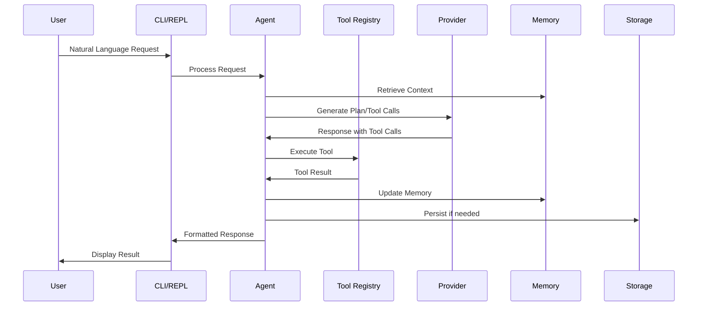

# Cortex: Technical Specification

## Version 1.0.0

## Table of Contents

1. [System Architecture](#system-architecture)
2. [Core Components](#core-components)
3. [Data Models](#data-models)
4. [API Specifications](#api-specifications)
5. [Tool System](#tool-system)
6. [Provider Interface](#provider-interface)
7. [Memory Architecture](#memory-architecture)
8. [Planning System](#planning-system)
9. [Security Model](#security-model)
10. [Configuration System](#configuration-system)
11. [Storage Layer](#storage-layer)
12. [UI/UX Specifications](#uiux-specifications)
13. [Performance Requirements](#performance-requirements)
14. [Deployment Options](#deployment-options)
15. [Testing Strategy](#testing-strategy)

---

## 1. System Architecture

### 1.1 High-Level Architecture

```
┌─────────────────────────────────────────────────────────────┐
│                    User Interface Layer                      │
├─────────────────────────────────────────────────────────────┤
│  CLI │ REPL │ API Gateway │ Web UI (Future) │ MCP Server    │
└─────────────────────────────────────────────────────────────┘
                              │
┌─────────────────────────────────────────────────────────────┐
│                    Agent Orchestration Layer                 │
├─────────────────────────────────────────────────────────────┤
│  Base Cortex Agent │ Enhanced Cortex Agent │ Subagents      │
└─────────────────────────────────────────────────────────────┘
                              │
┌─────────────────────────────────────────────────────────────┐
│                    Core Services Layer                       │
├─────────────────────────────────────────────────────────────┤
│  Conversation │ Planning │ Memory │ Security │ Recovery     │
└─────────────────────────────────────────────────────────────┘
                              │
┌─────────────────────────────────────────────────────────────┐
│                    Integration Layer                         │
├─────────────────────────────────────────────────────────────┤
│  Tool Registry │ Provider Factory │ Hook System │ AST       │
└─────────────────────────────────────────────────────────────┘
                              │
┌─────────────────────────────────────────────────────────────┐
│                    External Systems Layer                    │
├─────────────────────────────────────────────────────────────┤
│  Ollama │ DeepSeek │ Anthropic │ Git │ File System │ MCP    │
└─────────────────────────────────────────────────────────────┘
```

### 1.2 Component Interaction Flow



### 1.3 Deployment Architecture

**Single-Node Deployment** (Default):
```
┌─────────────────────────────────────┐
│          Developer Machine          │
├─────────────────────────────────────┤
│  Cortex Process                     │
│  ├── Agent Core                     │
│  ├── Local Ollama                   │
│  └── File System Access             │
└─────────────────────────────────────┘
```

**Client-Server Deployment** (Future):
```
┌─────────────────────┐    ┌─────────────────────┐
│   Client Machines   │    │     Server Node     │
│  (Thin Clients)     │◄──►│  (Cortex Server)    │
│  • CLI Interface    │    │  • Agent Processing │
│  • Local Tools      │    │  • Model Serving    │
└─────────────────────┘    │  • Shared Storage   │
                           └─────────────────────┘
```

## 2. Core Components

### 2.1 Agent System

#### Base Cortex Agent (`cortex/agent.py`)
- **Purpose**: Main conversation loop and tool execution
- **Key Responsibilities**:
  - Conversation state management
  - Tool orchestration
  - Permission enforcement
  - Error handling and recovery
- **Dependencies**: Provider Factory, Tool Registry, Conversation Manager

#### Enhanced Cortex Agent (`cortex/agent_enhanced.py`)
- **Purpose**: Extended agent with planning and layered memory
- **Extensions**:
  - Planning engine integration
  - Layered memory system
  - State management
  - Goal decomposition
- **Inheritance**: Extends Base Cortex Agent

#### Subagent System (`cortex/subagent/`)
- **Purpose**: Specialized agents for specific tasks
- **Types**:
  - Exploration agent
  - Search agent  
  - Analysis agent
  - General task agent
- **Isolation**: Limited tool access, controlled execution

### 2.2 CLI Interface (`cortex/cli.py`)
- **Entry Point**: `cortex` command
- **Features**:
  - Interactive REPL mode
  - One-shot command execution
  - Session management
  - Configuration loading
- **Commands**: See [COMMANDS.md](../docs/COMMANDS.md)

### 2.3 Provider Factory (`cortex/core/providers.py`)
- **Pattern**: Factory pattern for model providers
- **Supported Providers**:
  - `OllamaProvider`: Local models via Ollama
  - `DeepSeekProvider`: Cloud API integration
  - `AnthropicProvider`: Claude models
- **Auto-detection**: Model name pattern matching

### 2.4 Tool Registry (`cortex/tools/registry.py`)
- **Pattern**: Dynamic service registry
- **Features**:
  - Runtime tool registration
  - Namespace support
  - Enable/disable controls
  - Plugin loading
- **Tool Categories**: File, Git, Web, Analysis, System

## 3. Data Models

### 3.1 Message Types (`cortex/types.py`)

```python
class ToolResult(TypedDict):
    """Standard tool result format"""
    success: bool
    error: Optional[str]
    error_type: Optional[Literal["permission", "not_found", ...]]
    data: Optional[dict]

class Message(TypedDict):
    """Union type for all message types"""
    # System, User, Assistant, Tool message variants
```

### 3.2 Permission Model (`cortex/models.py`)
```python
class PermissionMode:
    NORMAL = "normal"      # Ask for approval
    AUTO_APPROVE = "auto"  # Skip permissions
    PLAN = "plan"          # Read-only mode
```

### 3.3 Planning Models (`cortex/core/planning.py`)
```python
class PlanStep:
    id: str
    description: str
    step_type: PlanStepType
    status: PlanStepStatus
    dependencies: List[str]
    tool_name: Optional[str]
    tool_arguments: Optional[Dict]
```

### 3.4 Configuration Model (`cortex/config.py`)
```python
class AgentConfig:
    model: str = "llama3.2"
    permission_mode: str = "normal"
    max_iterations: int = 15
    # ... 30+ configuration options
```

## 4. API Specifications

### 4.1 Internal APIs

#### Tool Execution API
```python
def execute_tool(
    tool_name: str,
    arguments: Union[str, Dict],
    permission_check: bool = True
) -> ToolResult:
    """
    Execute a tool with arguments.
    
    Args:
        tool_name: Name of the tool to execute
        arguments: Either JSON string or dict of arguments
        permission_check: Whether to check permissions
        
    Returns:
        ToolResult with success status and data
    """
```

#### Provider Interface
```python
class ModelProvider(ABC):
    @abstractmethod
    def chat(
        self,
        model: str,
        messages: List[Dict],
        tools: Optional[List[Dict]] = None
    ) -> Dict[str, Any]:
        """Send chat request to model"""
    
    @abstractmethod
    def stream_chat(...) -> Iterator[Dict[str, Any]]:
        """Stream chat responses"""
```

### 4.2 External APIs (Future)

#### REST API (Planned)
```
POST /api/v1/execute
Content-Type: application/json
{
  "prompt": "Add logging to api.py",
  "project_id": "proj_123",
  "config": {...}
}

Response:
{
  "task_id": "task_456",
  "status": "completed",
  "result": {...}
}
```

#### WebSocket API (Planned)
```
ws://localhost:8080/ws
Messages:
- {"type": "execute", "prompt": "...", "stream": true}
- {"type": "cancel", "task_id": "..."}
```

## 5. Tool System

### 5.1 Tool Architecture

```
Tool Definition → Tool Registry → Tool Execution → Result Processing
      │                   │               │               │
      ▼                   ▼               ▼               ▼
  Schema Validation  Namespace Mapping  Permission Check  Formatting
```

### 5.2 Tool Categories

#### File Tools (`cortex/tools/file_tools.py`)
- `read_file(path, offset, limit)`
- `write_file(path, content)`
- `edit(file_path, old_string, new_string)`
- `list_files(path, pattern)`
- `grep(pattern, path, output_mode)`
- `glob(pattern, path, include_hidden)`

#### Git Tools (`cortex/tools/git_tools.py`)
- `git_status()` - Show status and changes
- `git_diff(path)` - Show differences
- `git_commit(message)` - Commit changes
- `git_branch(action, branch_name)` - Branch operations
- `git_push(remote, branch)` - Push to remote
- `git_log(limit)` - Show commit history

#### Web Tools (`cortex/tools/web_tools.py`)
- `web_fetch(url, prompt, max_content_length)`
- `web_search(query, max_results, allowed_domains)`

#### Analysis Tools (`cortex/tools/ast/`)
- `ast_analyze(file_path, query_type)` - AST analysis
- `ast_extract(pattern, file_type)` - Code extraction
- `ast_search(pattern, language)` - Structural search

#### System Tools
- `execute_command(command, reason)` - Shell execution
- `run_tests(pattern, verbose)` - Test execution
- `skill_loader(action, skill_name, task_description)` - Skill management
- `todo_write(todos)` - Task tracking
- `ask_user_question(questions)` - Interactive prompts

### 5.3 Tool Registration

```python
# Tool registration example
registry.register(
    name="read_file",
    tool_class=ReadFileTool,
    schema={
        "name": "read_file",
        "description": "Read file contents",
        "parameters": {
            "type": "object",
            "properties": {
                "path": {"type": "string"},
                "offset": {"type": "integer"},
                "limit": {"type": "integer"}
            },
            "required": ["path"]
        }
    },
    namespace="builtin",
    enabled=True
)
```

## 6. Provider Interface

### 6.1 Provider Abstraction

```python
class ModelProvider(ABC):
    """Abstract base class for all providers"""
    
    @abstractmethod
    def chat(self, model, messages, tools=None) -> Dict:
        pass
    
    @abstractmethod
    def stream_chat(self, model, messages, tools=None) -> Iterator[Dict]:
        pass
    
    @abstractmethod
    def supports_streaming(self) -> bool:
        pass
    
    @abstractmethod
    def validate_api_key(self) -> bool:
        pass
    
    def _sanitize_request(self, messages, tools=None):
        """Sanitize inputs to remove invalid UTF-8"""
        pass
```

### 6.2 Supported Providers

#### Ollama Provider
- **Models**: Any Ollama model (llama3.2, qwen2.5:32b, deepseek-r1:8b)
- **Requirements**: Ollama service running locally
- **Features**: Local execution, no API keys needed

#### DeepSeek Provider
- **Models**: deepseek-chat, deepseek-coder, deepseek-reasoner
- **API Key**: `DEEPSEEK_API_KEY` environment variable
- **Cost**: ~$0.14 per million tokens (input)

#### Anthropic Provider
- **Models**: claude-4-5-sonnet, claude-4-haiku, claude-4-opus
- **API Key**: `ANTHROPIC_API_KEY` environment variable
- **Cost**: Varies by model ($0.80-$15 per million tokens)

### 6.3 Provider Selection Logic

```python
def get_provider(model: str, override: Optional[str] = None) -> ModelProvider:
    """
    Select provider based on model name or override.
    
    Logic:
    1. Use override if provided
    2. Match model name patterns:
       - "llama", "qwen", "deepseek-r1": Ollama
       - "deepseek-": DeepSeek
       - "claude-": Anthropic
    3. Default to Ollama
    """
```

## 7. Memory Architecture

### 7.1 Memory Layers

#### Working Memory
- **Purpose**: Current task context
- **Contents**: Active files, tool chain, immediate goals
- **Lifetime**: Per interaction
- **Size**: Limited (configurable)

#### Session Memory
- **Purpose**: Cross-interaction learning
- **Contents**: Patterns, user preferences, learned facts
- **Lifetime**: Per session
- **Persistence**: Optional saving

#### State Memory
- **Purpose**: Agent state tracking
- **Contents**: Focus, progress, current plan
- **Lifetime**: Per agent instance
- **Management**: State manager

#### Memory Bank
- **Purpose**: Fact storage and retrieval
- **Contents**: Extracted facts from conversations
- **Operations**: Add, query, prune
- **Persistence**: Session-based

### 7.2 Memory Operations

```python
# Working memory operations
working_memory.set_focus("src/utils.py")
working_memory.add_context("Currently refactoring authentication")

# Session memory operations
session_memory.learn_pattern("user_prefers_type_hints", True)
session_memory.recall_pattern("user_prefers_type_hints")

# State memory operations
state_manager.set_state(AgentState.ANALYZING)
state_manager.update_progress(0.5)

# Memory bank operations
memory_bank.add_fact("Project uses FastAPI framework", source="analysis")
memory_bank.query("What framework is used?")
```

## 8. Planning System

### 8.1 Plan Structure

```yaml
plan:
  id: "plan_001"
  goal: "Add authentication to API"
  status: "in_progress"
  steps:
    - id: "step_001"
      type: "analysis"
      description: "Analyze current API structure"
      status: "completed"
      tool: "grep"
      arguments: {"pattern": "^class.*API", "file_type": "py"}
      
    - id: "step_002"
      type: "implementation"
      description: "Add authentication middleware"
      status: "in_progress"
      dependencies: ["step_001"]
      expected_outcome: "Middleware added to main.py"
      
    - id: "step_003"
      type: "verification"
      description: "Test authentication flow"
      status: "pending"
      dependencies: ["step_002"]
```

### 8.2 Planning Process

1. **Goal Analysis**
   - Parse user request
   - Identify constraints and requirements
   - Determine success criteria

2. **Plan Generation**
   - Break goal into sub-tasks
   - Identify dependencies
   - Estimate complexity
   - Select appropriate tools

3. **Plan Execution**
   - Execute steps in dependency order
   - Monitor progress
   - Handle failures
   - Adapt plan as needed

4. **Verification**
   - Check expected vs actual outcomes
   - Validate success criteria
   - Generate completion report

### 8.3 Step Types

- **Tool Call**: Execute a specific tool
- **Subtask**: Delegate to subagent
- **Decision**: Make a choice based on analysis
- **Checkpoint**: Save progress state
- **Reflection**: Analyze results and adjust
- **Skill Application**: Apply learned skill

## 9. Security Model

### 9.1 Permission System

#### Permission Modes
- **Normal Mode**: Ask for approval on risky operations
- **Auto-approve Mode**: Skip permission checks (dangerous)
- **Plan Mode**: Read-only exploration

#### Permission Checks
```python
def check_permission(tool_name: str, arguments: Dict) -> bool:
    """
    Check if operation is permitted.
    
    Risky operations:
    - write_file (overwrites)
    - execute_command (shell access)
    - git_push (remote changes)
    - edit (file modifications)
    """
```

### 9.2 Security Boundaries

#### File System Safety
- Project directory isolation
- Path traversal prevention
- Symlink resolution checks
- File permission validation

#### Command Execution Safety
- Dangerous command blocking (`rm -rf`, `format`, etc.)
- Timeout enforcement
- Output size limits
- Environment variable filtering

#### API Security
- API key validation
- Request rate limiting
- Response size limits
- Error message sanitization

### 9.3 Recovery Mechanisms

- **Session checkpointing**: Automatic save points
- **Rollback capabilities**: Undo file changes
- **Error containment**: Isolate failures
- **Health monitoring**: Detect stuck states

## 10. Configuration System

### 10.1 Configuration Sources (Priority Order)

1. **CLI Arguments**: Highest priority, runtime overrides
2. **Environment Variables**: API keys and flags
3. **Config Files**: YAML configuration files
4. **Defaults**: Sensible built-in defaults

### 10.2 Configuration Schema

```yaml
# config/default.yaml
model: deepseek-reasoner
permission_mode: normal
max_iterations: 15
max_tokens: 100000

# Provider settings
provider: null  # auto-detect

# Session management
session_retention:
  max_age_days: 30
  max_count: 100
  cleanup_on_startup: false

# Parallel execution
parallel_execution:
  enabled: true
  max_workers: 4
  batch_size: 10

# Error recovery
error_recovery:
  max_repeats: 3
  stuck_threshold: 5
  recovery_strategy: "suggest"
```

### 10.3 Environment Variables

```bash
# Required for cloud providers
export DEEPSEEK_API_KEY="your_key"
export ANTHROPIC_API_KEY="your_key"

# Optional overrides
export CORTEX_MODEL="llama3.3:70b"
export CORTEX_PERMISSION_MODE="plan"
export CORTEX_CONFIG_PATH="/path/to/config.yaml"
```

## 11. Storage Layer

### 11.1 Storage Components

#### Session Storage
- **Location**: `~/.cortex/sessions/`
- **Format**: JSON with metadata
- **Retention**: Configurable (default 30 days)
- **Cleanup**: Automatic based on age and count

#### History Storage
- **Purpose**: Conversation history persistence
- **Format**: JSON lines (one per message)
- **Compression**: Optional gzip compression
- **Indexing**: By session ID and timestamp

#### Cache Storage
- **AST Cache**: Parse tree caching
- **File Cache**: File content caching
- **Tool Cache**: Tool result caching
- **Configuration**: Size and TTL controls

### 11.2 Data Models

```python
class Session:
    id: str
    created_at: datetime
    project_dir: Path
    config: Dict
    history: List[Message]
    metadata: Dict
    
class Checkpoint:
    id: str
    session_id: str
    timestamp: datetime
    history_snapshot: List[Message]
    health_score: float
```

## 12. UI/UX Specifications

### 12.1 CLI Interface

#### REPL Features
- **Syntax Highlighting**: Code and markdown
- **Auto-completion**: Command and path completion
- **History Navigation**: Arrow keys and search
- **Multi-line Input**: Support for complex commands
- **Progress Indicators**: Spinners and progress bars

#### Output Formatting
- **Markdown Rendering**: GitHub-flavored markdown
- **Code Blocks**: Syntax-highlighted code
- **Tables**: Formatted data tables
- **Panels**: Grouped information displays
- **Status Indicators**: Success/error/warning icons

### 12.2 Display Components

```python
# Rich console components
console.print(Panel("[bold]Analysis Complete[/bold]"))
console.print(Table(title="File Analysis"))
console.print(Markdown("# Results\\n\\nHere are the findings..."))
console.print("[green]✓[/green] Task completed successfully")
```

### 12.3 Interaction Patterns

#### Progressive Disclosure
- Show essential information first
- Expand details on request
- Collapsible sections for verbose output

#### Status Communication
- Clear progress indicators
- Estimated time remaining
- Task completion summaries
- Error recovery suggestions

## 13. Performance Requirements

### 13.1 Response Time Targets

| Operation | Target | Acceptable |
|-----------|---------|------------|
| Simple file read | < 100ms | < 500ms |
| Code analysis | < 1s | < 5s |
| Model response (local) | < 3s | < 10s |
| Model response (cloud) | < 2s | < 5s |
| Complex multi-step task | < 30s | < 2min |

### 13.2 Resource Limits

#### Memory Usage
- **Base agent**: < 100MB
- **With AST cache**: < 500MB
- **Maximum limit**: 1GB (configurable)

#### Disk Usage
- **Session storage**: 500MB default limit
- **Cache storage**: 50MB default limit
- **Cleanup**: Automatic when limits exceeded

#### CPU Usage
- **Idle**: < 1% CPU
- **Active processing**: < 50% CPU sustained
- **Parallel operations**: Configurable worker count

### 13.3 Scalability Considerations

#### Vertical Scaling
- Memory-optimized operations
- Lazy loading of resources
- Cache warming strategies
- Connection pooling

#### Horizontal Scaling (Future)
- Stateless agent design
- Shared session storage
- Load balancing
- Fault tolerance

## 14. Deployment Options

### 14.1 Local Development

```bash
# Basic installation
pip install -r requirements.txt
pip install -e .

# With development tools
pip install -r requirements-dev.txt
pip install -r requirements-test.txt

# Run tests
pytest tests/ -v
```

### 14.2 Docker Deployment

```dockerfile
# Dockerfile example
FROM python:3.11-slim
WORKDIR /app
COPY requirements.txt .
RUN pip install --no-cache-dir -r requirements.txt
COPY . .
ENTRYPOINT ["cortex"]
```

### 14.3 Production Considerations

#### Security Hardening
- Non-root user execution
- Read-only filesystem where possible
- Network access restrictions
- Resource limit enforcement

#### Monitoring
- Health check endpoints
- Metrics collection (Prometheus)
- Log aggregation (ELK stack)
- Alerting configuration

## 15. Testing Strategy

### 15.1 Test Pyramid

```
        ↗ Integration Tests (30%)
       ↗ Component Tests (40%)
     ↗ Unit Tests (30%)
```

### 15.2 Test Categories

#### Unit Tests
- **Location**: `tests/unit/`
- **Coverage**: Individual components
- **Mocking**: External dependencies mocked
- **Examples**: Tool functions, utility classes

#### Integration Tests
- **Location**: `tests/integration/`
- **Coverage**: Component interactions
- **Setup**: Real tool execution where safe
- **Examples**: Agent workflows, provider integration

#### System Tests
- **Location**: `tests/system/` (planned)
- **Coverage**: End-to-end workflows
- **Environment**: Isolated test environments
- **Examples**: Complete user scenarios

### 15.3 Test Infrastructure

#### Fixtures
- Mock file systems
- Fake model responses
- Test project structures
- Temporary directories

#### Test Configuration
- Isolated configuration per test
- Environment variable management
- Clean state between tests
- Parallel test execution

#### Coverage Requirements
- **Code coverage**: > 80%
- **Branch coverage**: > 70%
- **Critical paths**: 100% coverage
- **Security tests**: Mandatory for risky operations

---

## Appendix A: Glossary

- **Agent**: The core Cortex instance processing requests
- **Provider**: Model service (Ollama, DeepSeek, Anthropic)
- **Tool**: Function that Cortex can execute
- **Plan**: Structured sequence of steps to achieve a goal
- **Session**: Persistent conversation context
- **MCP**: Model Context Protocol for external tool integration
- **AST**: Abstract Syntax Tree for code analysis

## Appendix B: References

- [Ollama Documentation](https://ollama.ai/)
- [DeepSeek API Documentation](https://platform.deepseek.com/api-docs/)
- [Anthropic Claude API](https://docs.anthropic.com/claude/reference/)
- [Model Context Protocol](https://spec.modelcontextprotocol.io/)
- [Tree-sitter](https://tree-sitter.github.io/tree-sitter/)

## Appendix C: Revision History

| Version | Date | Changes | Author |
|---------|------|---------|--------|
| 1.0.0 | 2024-01-15 | Initial technical specification | Cortex Team |
| 0.9.0 | 2024-01-10 | Draft for review | AI Assistant |

---

*This document defines the technical specifications for Cortex version 1.0.0. All implementations should adhere to these specifications unless explicitly overridden by configuration or runtime requirements.*