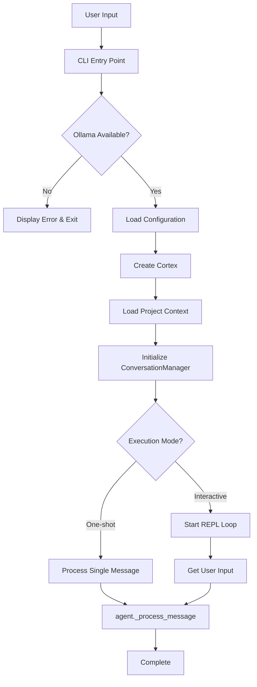
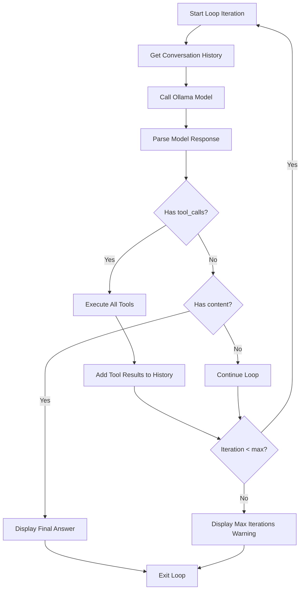
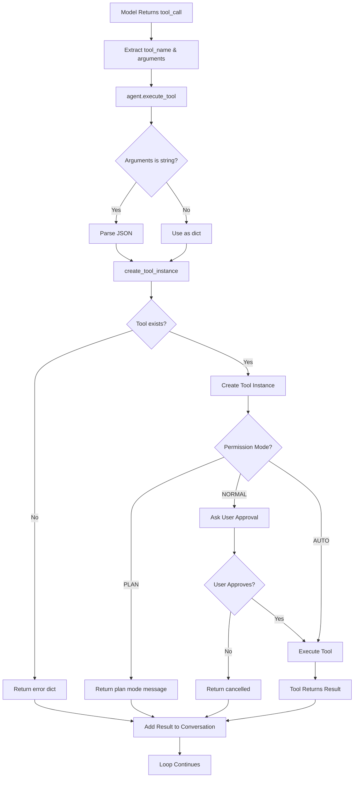
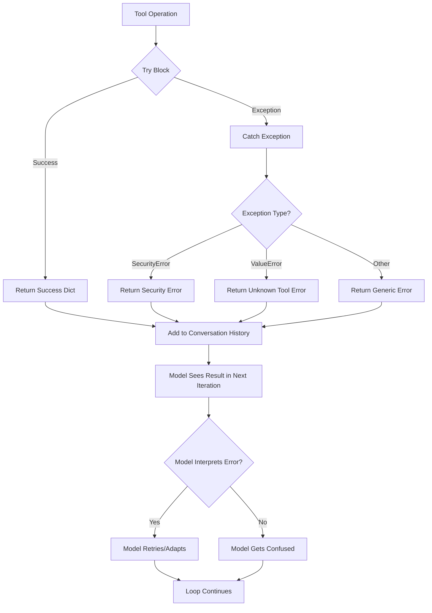

# Cortex Architecture and Data Flow Analysis

## Overview
This document provides a comprehensive analysis of Cortex's architecture, data flow, and workflow patterns.

## 1. System Architecture

### 1.1 Component Overview

Cortex is organized into the following main components:

- **CLI Layer** (`cortex/cli.py`): Entry point, argument parsing, session management
- **Agent Core** (`cortex/agent.py`): Main orchestration, agent loop, tool execution
- **Conversation Management** (`cortex/core/conversation.py`): History tracking and optimization
- **Tool System** (`cortex/tools/`): Tool definitions and implementations
- **Streaming** (`cortex/core/streaming.py`): Streaming response handling
- **Context Management** (`cortex/core/context.py`): Token counting and history truncation
- **Security** (`cortex/core/security.py`): Path validation and safety checks
- **UI** (`cortex/ui/`): Console output and REPL interface

### 1.2 Entry Points

**Primary Entry Point:**
- `cortex/cli.py::main()` - CLI argument parsing and initialization

**Two Execution Modes:**
1. **One-shot mode**: `agent._process_message(prompt)` - Single task execution
2. **Interactive mode**: `run_interactive()` - REPL loop with command handling

## 2. Complete Request-to-Response Flow

### 2.1 Initialization Flow

```
CLI Entry (cli.py:main)
    ↓
Check Ollama Connection
    ↓
Load Configuration (AgentConfig)
    ↓
Determine Permission Mode
    ↓
Create Cortex Instance
    ├─ Load Project Context (AGENT.md, README.md)
    ├─ Generate System Prompt
    └─ Initialize ConversationManager
        └─ Create history with system message
    ↓
Load Session (if --load-session)
    ↓
Enter Execution Mode (one-shot or interactive)
```

### 2.2 Message Processing Flow

The core agent loop is in `agent.py::_process_message()`:

```
User Input
    ↓
Add User Message to Conversation
    ↓
┌─────────────────────────────────────┐
│ Agent Loop (max_iterations)        │
│                                     │
│ 1. Get Conversation History         │
│ 2. Call Model (Ollama)              │
│    ├─ Non-streaming: ollama.chat()  │
│    └─ Streaming: stream_ollama()     │
│ 3. Parse Response                    │
│    ├─ Has tool_calls?               │
│    │   YES → Execute Tools           │
│    │   NO  → Display Final Answer    │
│ 4. Add Response to History           │
│ 5. Loop or Exit                      │
└─────────────────────────────────────┘
```

## 3. Agent Loop Detailed Flow

### 3.1 Loop Structure

Located in `agent.py` lines 152-217:

```python
for iteration in range(max_iterations):
    # 1. Get conversation history
    messages = self.conversation.get_history()
    
    # 2. Call model
    response = self._call_model(messages, TOOLS)
    response_message = response["message"]
    
    # 3. Add assistant response to history
    self.conversation.add_assistant_message(...)
    
    # 4. Check for tool calls
    if response_message.get("tool_calls"):
        # Execute tools and add results
        for tool_call in tool_calls:
            result = self.execute_tool(...)
            self.conversation.add_tool_result(...)
        # Loop continues
    else:
        # Final response - exit loop
        display_final_answer()
        return
```

### 3.2 Exit Conditions

The agent loop exits when:

1. **Final Answer**: Model returns response with `content` but no `tool_calls` (line 193-204)
2. **Exception**: ModelError or general Exception caught (lines 206-215)
3. **Max Iterations**: Loop reaches `max_iterations` limit (line 217)

**Critical Issue**: If tool execution fails, the loop continues without checking for errors. The model receives tool results but may not properly interpret failures.

## 4. Conversation History Structure

### 4.1 Message Format

The conversation history follows this structure:

```python
[
    {
        "role": "system",
        "content": "System prompt with guidelines..."
    },
    {
        "role": "user",
        "content": "User's request"
    },
    {
        "role": "assistant",
        "content": "Optional text response",
        "tool_calls": [
            {
                "id": "call_123",
                "function": {
                    "name": "read_file",
                    "arguments": {"path": "file.py"}
                }
            }
        ]
    },
    {
        "role": "tool",
        "tool_call_id": "call_123",
        "content": "{\"success\": true, \"content\": \"...\"}"
    }
]
```

### 4.2 History Management

**ConversationManager** (`conversation.py`):
- Maintains `self.history` list
- Automatically optimizes when tokens exceed limit
- Methods:
  - `add_user_message()` - Adds user input
  - `add_assistant_message()` - Adds model response
  - `add_tool_result()` - Adds tool execution result (as JSON string)
  - `get_history()` - Returns copy of history
  - `_optimize()` - Truncates if over token limit

**Token Management** (`context.py`):
- Estimates tokens using `len(text) // 4` approximation
- Truncates history keeping system message + recent N messages
- **Issue**: Token estimation is rough and may not match actual model tokenization

## 5. Tool Integration Flow

### 5.1 Tool Call Execution Path

```
Model Response with tool_calls
    ↓
Extract tool_name and arguments
    ↓
agent.execute_tool(tool_name, arguments)
    ├─ Parse arguments (handle JSON string)
    ├─ Create tool instance (create_tool_instance)
    └─ Execute tool.execute(**arguments)
        ↓
Tool Returns Result Dict
    ↓
Add Result to Conversation History
    {
        "role": "tool",
        "tool_call_id": "...",
        "content": json.dumps(result)
    }
    ↓
Loop Continues - Model Sees Tool Result
```

### 5.2 Tool Result Format

Tools return dictionaries with varying structures:

**Success Format:**
```python
{
    "success": True,
    "content": "...",  # For read_file
    "output": "...",   # For execute_command
    "files": [...],    # For list_files
    # ... tool-specific fields
}
```

**Error Format:**
```python
{
    "error": "Error message here"
}
# OR
{
    "success": False,
    "message": "Error message"
}
```

**Critical Issue**: Inconsistent error formats across tools. Some use `{"error": "..."}`, others use `{"success": False, "message": "..."}`. The model may not consistently recognize failures.

### 5.3 Tool Factory

`tools/__init__.py::create_tool_instance()`:
- Maps tool names to tool classes
- Creates instance with: `project_dir`, `permission_mode`, `console`
- Raises `ValueError` for unknown tools

## 6. Streaming vs Non-Streaming

### 6.1 Non-Streaming Mode (Default)

```python
response = ollama.chat(
    model=self.model,
    messages=messages,
    tools=TOOLS
)
response_message = response["message"]
```

### 6.2 Streaming Mode

```python
stream = stream_ollama_response(model, messages, TOOLS)
response_message = display_streaming_response(stream)
```

**Streaming Implementation** (`streaming.py`):
- Collects chunks from Ollama stream
- Accumulates content and tool_calls
- Merges tool_calls by ID
- Returns complete message dict

**Issue**: Streaming mode may have different behavior than non-streaming, especially for tool calls.

## 7. Error Handling Flow

### 7.1 Error Propagation

```
Tool Execution Error
    ↓
Tool returns {"error": "..."}
    ↓
Result added to conversation history
    ↓
Model receives error in next iteration
    ↓
Model should handle error and retry/adapt
```

**Critical Issue**: No explicit error checking after tool execution. The agent assumes the model will interpret error results correctly.

### 7.2 Exception Handling

**In `_process_message()`:**
- `ModelError`: Caught, displayed, loop exits
- General `Exception`: Caught, displayed, loop exits

**In `execute_tool()`:**
- `ValueError`: Returns `{"error": "Unknown tool"}`
- `SecurityError`: Returns `{"error": str(e)}`
- General `Exception`: Returns `{"error": str(e)}`

**Issue**: Exceptions in tool execution are caught and converted to error dicts, but there's no validation that the model understands these errors.

## 8. Permission Mode Handling

Three permission modes:

1. **NORMAL**: Ask user for approval (via `Confirm.ask()`)
2. **AUTO_APPROVE**: Execute without asking
3. **PLAN**: Read-only, return early with message

**Implementation**: Each tool checks `self.permission_mode` and handles accordingly.

## 9. Key Findings

### 9.1 Architecture Strengths

- Clean separation of concerns
- Modular tool system
- Conversation history management
- Token optimization

### 9.2 Architecture Weaknesses

1. **No Error Validation**: Tool errors are passed to model without validation
2. **Inconsistent Error Formats**: Different tools use different error structures
3. **No Loop Guards**: No detection of infinite loops or repeated failures
4. **Rough Token Estimation**: Simple character-based estimation may be inaccurate
5. **No Tool Result Validation**: Results are added to history without checking success
6. **Streaming Differences**: Potential behavioral differences between streaming/non-streaming

## 10. Data Flow Diagrams

### 10.1 Complete Request Flow



### 10.2 Agent Loop Decision Tree



### 10.3 Tool Execution Flow



### 10.4 Error Handling Flow



