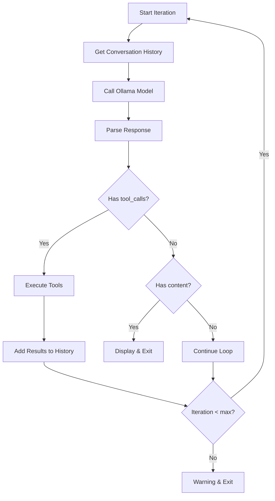

# Conversation Flow Analysis

## Overview
This document analyzes the conversation flow, loop termination conditions, and how tool results are interpreted by the model in subsequent iterations.

## 1. Loop Termination Conditions

### 1.1 Exit Conditions

The agent loop in `agent.py::_process_message()` exits under these conditions:

#### Condition 1: Final Answer (Normal Exit)
**Location**: Lines 193-204

```python
if not response_message.get("tool_calls"):
    final_text = response_message.get("content", "")
    if final_text:
        console.print(Panel(...))
    return  # Exit loop
```

**Trigger**: Model returns response with `content` but no `tool_calls`

**Issue**: If model returns empty content and no tool_calls, loop continues unnecessarily.

#### Condition 2: Model Error (Exception Exit)
**Location**: Lines 206-210

```python
except ModelError as e:
    console.print(f"[red]Model Error:[/red] {e}")
    console.print("[dim]" + traceback.format_exc() + "[/dim]")
    return  # Exit loop
```

**Trigger**: `_call_model()` raises `ModelError`

**Issue**: Loop exits immediately on model error, no retry or recovery.

#### Condition 3: General Exception (Exception Exit)
**Location**: Lines 211-215

```python
except Exception as e:
    console.print(f"[red]Error:[/red] {e}")
    console.print("[dim]" + traceback.format_exc() + "[/dim]")
    return  # Exit loop
```

**Trigger**: Any other exception in the loop

**Issue**: Catches all exceptions, including potentially recoverable ones.

#### Condition 4: Max Iterations (Warning Exit)
**Location**: Line 217

```python
console.print("[yellow]⚠️  Reached maximum iterations[/yellow]")
# Loop ends naturally
```

**Trigger**: Loop reaches `max_iterations` limit

**Issue**: Only displays warning, doesn't indicate what was accomplished or what failed.

### 1.2 Loop Continuation Conditions

The loop continues when:
- Model returns `tool_calls` (lines 181-192)
- Model returns empty `content` and no `tool_calls` (implicitly continues)

**Critical Issue**: No explicit check for:
- Repeated tool failures
- Same tool called multiple times with same arguments
- Tool errors that should stop the loop
- Infinite loops

## 2. Tool Result Interpretation

### 2.1 How Tool Results Are Added

**Location**: `conversation.py` lines 47-55

```python
def add_tool_result(self, tool_call_id: str, result: Dict[str, Any]) -> None:
    import json
    self.history.append({
        "role": "tool",
        "tool_call_id": tool_call_id,
        "content": json.dumps(result)  # JSON stringified!
    })
    self._optimize()
```

**Issue**: Results are JSON-stringified, so model receives them as strings.

### 2.2 Model Receives Tool Results

On next iteration:
1. `conversation.get_history()` returns full history including tool result
2. History is passed to `ollama.chat(messages=messages, tools=TOOLS)`
3. Model sees tool result as JSON string in `content` field
4. Model must parse JSON to understand result

**Example History:**
```python
[
    {"role": "system", "content": "..."},
    {"role": "user", "content": "Read file.py"},
    {
        "role": "assistant",
        "tool_calls": [{"function": {"name": "read_file", "arguments": {"path": "file.py"}}}]
    },
    {
        "role": "tool",
        "tool_call_id": "call_0",
        "content": '{"success": true, "content": "..."}'  # JSON string!
    }
]
```

### 2.3 Model Interpretation Challenges

The model must:
1. **Parse JSON**: Extract result from JSON string
2. **Check Success**: Determine if operation succeeded
3. **Handle Errors**: Understand error format and decide next action
4. **Extract Data**: Get relevant data from result
5. **Decide Next Step**: Continue with tools or provide final answer

**Critical Issues**:
- No validation that model parsed JSON correctly
- No validation that model understood success/failure
- No guidance on what to do with errors
- Model might misinterpret results

## 3. Conversation History Management

### 3.1 History Structure

**Location**: `conversation.py` lines 20-23

```python
self.history: List[Dict[str, Any]] = [
    {"role": "system", "content": system_prompt}
]
```

**Message Types**:
- `system`: System prompt (always first)
- `user`: User messages
- `assistant`: Model responses (may include `tool_calls`)
- `tool`: Tool execution results

### 3.2 History Optimization

**Location**: `conversation.py` lines 68-77

```python
def _optimize(self) -> None:
    current_tokens = get_conversation_tokens(self.history)
    if current_tokens > self.max_tokens:
        self.history = truncate_history(
            self.history,
            max_tokens=self.max_tokens,
            keep_system=True,
            keep_recent=self.keep_recent
        )
```

**Called After**:
- `add_user_message()`
- `add_assistant_message()`
- `add_tool_result()`

**Issue**: Optimization happens after every message, which is efficient but might truncate important context.

### 3.3 Token Estimation

**Location**: `context.py` lines 7-18

```python
def estimate_tokens(text: str) -> int:
    return len(text) // 4  # Rough approximation
```

**Issue**: 
- Very rough approximation (4 chars per token)
- Actual tokenization varies by model
- May underestimate or overestimate significantly
- Could lead to premature truncation or not truncating when needed

### 3.4 History Truncation

**Location**: `context.py` lines 21-75

```python
def truncate_history(...):
    # Keep system message
    # Keep recent N messages
    # Drop older messages
```

**Strategy**:
- Always keeps system message
- Keeps most recent `keep_recent` messages (default: 20)
- Drops older messages

**Issues**:
- Might drop important context from earlier in conversation
- No summarization of dropped messages
- Tool results might be dropped, losing context
- No distinction between important and unimportant messages

## 4. Loop Iteration Flow

### 4.1 Single Iteration Steps



### 4.2 What Happens on Each Iteration

**Iteration N:**
1. Get conversation history (includes all previous messages + tool results)
2. Call model with history
3. Model sees:
   - System prompt
   - User request
   - Previous assistant responses
   - Tool results (as JSON strings)
4. Model decides: use tools or provide final answer
5. If tools: execute and add results
6. If final answer: display and exit

**Critical Issue**: No explicit feedback loop to validate that:
- Tool execution succeeded
- Model understood tool results
- Next action is appropriate

## 5. Tool Result Impact on Next Decision

### 5.1 Successful Tool Execution

**Scenario**: Tool executes successfully

**Result Added**:
```python
{"role": "tool", "content": '{"success": true, "content": "..."}'}
```

**Model Sees**: Success result in next iteration

**Expected Behavior**: Model uses result data to continue task

**Potential Issues**:
- Model might not parse JSON correctly
- Model might not extract relevant data
- Model might call same tool again unnecessarily

### 5.2 Failed Tool Execution

**Scenario**: Tool execution fails

**Result Added**:
```python
{"role": "tool", "content": '{"error": "File not found"}'}
```

**Model Sees**: Error result in next iteration

**Expected Behavior**: Model handles error and adapts

**Potential Issues**:
- Model might not recognize error format
- Model might retry same operation (infinite loop)
- Model might give up prematurely
- Model might not understand error context

### 5.3 Permission Denial

**Scenario**: Tool denied due to permission mode

**Result Added**:
```python
{"role": "tool", "content": '{"success": false, "message": "Plan mode - no writes allowed"}'}
```

**Model Sees**: Failure result (but it's a permission denial, not an error)

**Expected Behavior**: Model understands this is a permission issue, not an error

**Potential Issues**:
- Model might interpret as error and retry
- Model might not understand permission mode constraints
- Model might try different approach that also gets denied

## 6. Loop Guard Mechanisms

### 6.1 Current Guards

**Max Iterations**: Prevents infinite loops by limiting iterations

**Location**: `agent.py` line 150

```python
max_iterations = self.config.max_iterations
for iteration in range(max_iterations):
```

**Default**: Likely 20 (from config)

**Issue**: No other guards against:
- Repeated tool failures
- Same tool called repeatedly
- Tool errors that should stop loop
- Stuck states

### 6.2 Missing Guards

**No Detection For**:
- Same tool called 3+ times with same arguments
- Tool errors repeated 3+ times
- No progress made (same state for multiple iterations)
- Tool results indicating task is impossible

**Recommendation**: Add loop guards to detect and handle these cases.

## 7. Conversation Context Loss

### 7.1 Truncation Impact

When history is truncated:
- Older messages are dropped
- Tool results might be lost
- Context about what was tried is lost
- Model might repeat failed attempts

**Example**:
1. Iteration 1: Try to read file A (fails)
2. Iteration 2: Try to read file B (succeeds)
3. Iteration 3: Make changes based on file B
4. History truncates, drops iteration 1
5. Iteration 4: Model might try file A again (doesn't remember it failed)

### 7.2 Token Estimation Inaccuracy

Rough token estimation might:
- Underestimate: History grows too large, model context window exceeded
- Overestimate: History truncated prematurely, losing important context

**Impact**: Model might lose track of what was done or what failed.

## 8. Key Findings

### 8.1 Strengths

- Clean loop structure
- Automatic history optimization
- Max iterations prevents infinite loops
- Tool results properly added to history

### 8.2 Critical Issues

1. **No Result Validation**: Tool results added without checking if model will understand them
2. **JSON Stringification**: Results as strings make parsing error-prone
3. **No Loop Guards**: No detection of stuck states or repeated failures
4. **Rough Token Estimation**: May cause premature truncation or context loss
5. **No Error Recovery**: Errors cause immediate exit, no retry logic
6. **No Progress Tracking**: No way to detect if loop is making progress
7. **Truncation Loss**: Important context might be dropped
8. **Empty Content Handling**: Empty content + no tools continues loop unnecessarily

## 9. Recommendations

### 9.1 Add Result Validation

Before adding tool results, validate:
- Result has expected structure
- Success/error is clearly indicated
- Model can parse and understand result

### 9.2 Pass Structured Results

Instead of JSON stringification, pass structured objects so model can directly access fields.

### 9.3 Add Loop Guards

Detect and handle:
- Repeated tool failures
- Same tool called multiple times
- No progress made
- Stuck states

### 9.4 Improve Token Estimation

Use more accurate token estimation (e.g., tiktoken library) or actual model tokenization.

### 9.5 Add Progress Tracking

Track what has been accomplished and what has failed to help model make better decisions.

### 9.6 Handle Empty Responses

If model returns empty content and no tools, either:
- Ask model to provide answer
- Exit with message
- Don't continue loop unnecessarily

