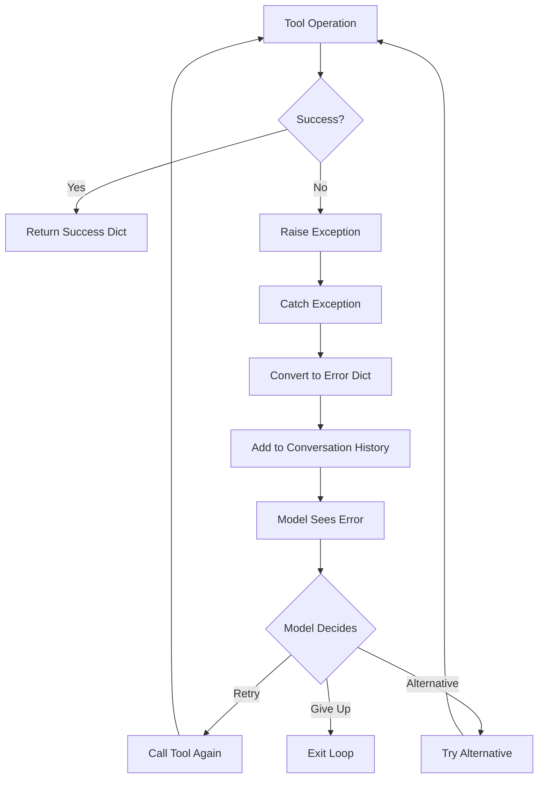

# Error Handling Analysis

## Overview
This document analyzes error handling, error propagation, and recovery mechanisms throughout the LocalAgent codebase.

## 1. Error Types and Hierarchy

### 1.1 Custom Error Classes

**Location**: `utils/errors.py`

```python
class AgentError(Exception):
    """Base exception for agent errors"""
    pass

class ToolExecutionError(AgentError):
    """Error during tool execution"""
    pass

class ModelError(AgentError):
    """Error calling the model"""
    pass
```

**Observations**:
- Custom error hierarchy exists
- `ToolExecutionError` is defined but **never used** in codebase
- Only `ModelError` is actually used
- Most errors are generic `Exception`

### 1.2 Security Errors

**Location**: `core/security.py` lines 7-9

```python
class SecurityError(Exception):
    """Security-related error"""
    pass
```

**Usage**: Used for path validation and dangerous command detection

## 2. Error Propagation Paths

### 2.1 Model Call Errors

**Location**: `agent.py` lines 102-112

```python
@retry_with_backoff(max_retries=3, exceptions=(Exception,))
def _call_model(self, messages: List[Dict[str, Any]], tools: List[Dict[str, Any]]) -> Dict[str, Any]:
    try:
        return ollama.chat(...)
    except Exception as e:
        raise ModelError(f"Failed to call model: {e}") from e
```

**Error Flow**:
1. `ollama.chat()` raises exception
2. Caught and wrapped in `ModelError`
3. Retry logic attempts up to 3 times
4. If all retries fail, `ModelError` propagates to `_process_message()`

**Handling in `_process_message()`**: Lines 206-210
```python
except ModelError as e:
    console.print(f"[red]Model Error:[/red] {e}")
    console.print("[dim]" + traceback.format_exc() + "[/dim]")
    return  # Exit loop
```

**Issue**: Loop exits immediately, no recovery or partial completion reporting.

### 2.2 Tool Execution Errors

**Location**: `agent.py` lines 114-141

```python
def execute_tool(self, tool_name: str, arguments: Dict[str, Any]) -> Dict[str, Any]:
    try:
        tool = create_tool_instance(...)
        return tool.execute(**arguments)
    except ValueError as e:
        return {"error": f"Unknown tool: {tool_name}"}
    except SecurityError as e:
        return {"error": str(e)}
    except Exception as e:
        return {"error": str(e)}
```

**Error Flow**:
1. Tool execution raises exception
2. Caught and converted to error dict
3. Error dict returned (not raised)
4. Error dict added to conversation history
5. Model sees error in next iteration

**Issue**: Errors are converted to dicts, so they don't propagate as exceptions. The agent loop continues regardless of tool failures.

### 2.3 Tool-Level Errors

**Pattern in all tools**:
```python
try:
    # Tool operation
    return {"success": True, ...}
except SecurityError as e:
    return {"error": str(e)}
except Exception as e:
    return {"error": str(e)}
```

**Error Flow**:
1. Tool operation fails
2. Exception caught
3. Converted to error dict
4. Returned to `execute_tool()`
5. Passed through to conversation history

**Issue**: All exceptions treated the same, no distinction between recoverable and non-recoverable errors.

## 3. Error Recovery Mechanisms

### 3.1 Model Call Retry

**Location**: `agent.py` line 102

```python
@retry_with_backoff(max_retries=3, exceptions=(Exception,))
def _call_model(self, ...):
```

**Retry Logic**: `utils/errors.py` (not shown, but referenced)

**Behavior**:
- Retries up to 3 times on any exception
- Uses exponential backoff
- If all retries fail, raises `ModelError`

**Issue**: Retries on ALL exceptions, including non-recoverable ones (e.g., invalid model name).

### 3.2 Tool Execution Retry

**Current State**: **NO RETRY LOGIC**

Tool execution errors are:
1. Caught and converted to error dict
2. Added to conversation history
3. Model sees error and decides what to do

**Issue**: No automatic retry for transient failures (e.g., network timeouts, file locks).

### 3.3 Model-Driven Recovery

**Current Approach**: Model sees tool errors and decides how to handle them

**Flow**:
1. Tool fails, returns error dict
2. Error dict added to history
3. Model sees error in next iteration
4. Model decides: retry, try alternative, or give up

**Issues**:
- Model might not recognize error format
- Model might retry unnecessarily (infinite loop)
- Model might give up prematurely
- No guidance on what to do with errors

## 4. Error Communication

### 4.1 Error Format to Model

**Tool Errors**:
```python
{"error": "Error message"}
# OR
{"success": False, "message": "Error message"}
```

**Added to History**:
```python
{
    "role": "tool",
    "tool_call_id": "...",
    "content": '{"error": "Error message"}'  # JSON stringified
}
```

**Issue**: Model must parse JSON string to understand error.

### 4.2 User-Facing Errors

**Model Errors**:
```python
console.print(f"[red]Model Error:[/red] {e}")
console.print("[dim]" + traceback.format_exc() + "[/dim]")
```

**Tool Errors**: Displayed by individual tools via console

**Issue**: Errors shown to user but not always clearly communicated to model.

## 5. Error Handling Gaps

### 5.1 Missing Error Types

**No Distinction Between**:
- Transient errors (network, file locks) → Should retry
- Permanent errors (file not found, invalid path) → Should not retry
- Permission errors → Should not retry
- Validation errors → Should retry with corrected input

### 5.2 No Error Context

**Missing Information**:
- What operation failed
- Why it failed
- What was attempted
- What should be done next

### 5.3 No Error Recovery

**Missing Mechanisms**:
- Automatic retry for transient failures
- Alternative approaches for permanent failures
- Error escalation for critical failures
- Partial completion reporting

## 6. Error Handling by Component

### 6.1 Agent Loop

**Location**: `agent.py::_process_message()` lines 206-215

```python
except ModelError as e:
    # Display and exit
except Exception as e:
    # Display and exit
```

**Issues**:
- Catches all exceptions, including potentially recoverable ones
- Exits immediately, no recovery
- No distinction between error types

### 6.2 Tool Execution

**Location**: `agent.py::execute_tool()` lines 114-141

```python
try:
    # Execute tool
except ValueError:
    return {"error": "Unknown tool"}
except SecurityError:
    return {"error": str(e)}
except Exception:
    return {"error": str(e)}
```

**Issues**:
- All exceptions converted to error dicts
- No distinction between error types
- Errors don't propagate, loop continues

### 6.3 Individual Tools

**Pattern**: All tools catch exceptions and return error dicts

**Issues**:
- Generic exception handling loses error context
- No distinction between error types
- No retry logic

## 7. Error Propagation Diagram



## 8. Error Handling Best Practices (Missing)

### 8.1 Error Classification

**Should Have**:
- Transient vs. permanent errors
- Recoverable vs. non-recoverable errors
- Expected vs. unexpected errors

**Currently**: All errors treated the same

### 8.2 Error Context

**Should Include**:
- Operation that failed
- Input parameters
- Error type
- Suggested recovery action

**Currently**: Only error message string

### 8.3 Retry Strategy

**Should Have**:
- Automatic retry for transient errors
- Exponential backoff
- Max retry limits
- Retry only for specific error types

**Currently**: Only model call has retry, tools don't

### 8.4 Error Recovery

**Should Have**:
- Alternative approaches
- Fallback mechanisms
- Partial completion
- Error escalation

**Currently**: No recovery, model must handle

## 9. Key Findings

### 9.1 Strengths

- Custom error hierarchy exists (though underused)
- Model call has retry logic
- Errors are caught and don't crash the system
- User sees error messages

### 9.2 Critical Issues

1. **No Error Classification**: All errors treated the same
2. **No Automatic Recovery**: No retry for transient failures
3. **No Error Context**: Missing information about what/why/how
4. **Model-Driven Recovery**: Relies on model to handle errors correctly
5. **No Error Validation**: No check if model understood error
6. **Generic Exception Handling**: Loses specific error information
7. **Tool Errors Don't Propagate**: Converted to dicts, loop continues
8. **No Recovery Guidance**: Model has no guidance on error handling

## 10. Recommendations

### 10.1 Classify Errors

Add error types:
- `TransientError`: Should retry
- `PermanentError`: Should not retry
- `PermissionError`: Should not retry
- `ValidationError`: Should retry with corrected input

### 10.2 Add Error Context

Include in error responses:
- Error type
- Operation that failed
- Input parameters
- Suggested recovery action

### 10.3 Implement Retry Logic

Add automatic retry for:
- Transient errors (network, file locks)
- With exponential backoff
- Max retry limits
- Only for specific error types

### 10.4 Improve Error Communication

- Pass structured error objects, not just strings
- Include error type and context
- Provide recovery suggestions
- Validate model understands errors

### 10.5 Add Recovery Mechanisms

- Alternative approaches for permanent failures
- Fallback mechanisms
- Partial completion reporting
- Error escalation for critical failures

