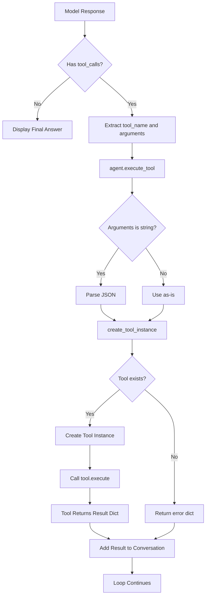

# Tool Integration Flow Analysis

## Overview
This document analyzes how tools are integrated into the LocalAgent workflow, from model response through execution to result handling.

## 1. Tool Call Flow

### 1.1 Complete Tool Execution Path



### 1.2 Code Flow

**Location**: `agent.py` lines 181-192

```python
if response_message.get("tool_calls"):
    for tool_call in response_message["tool_calls"]:
        tool_name = tool_call["function"]["name"]
        arguments = tool_call["function"]["arguments"]
        
        # Execute
        result = self.execute_tool(tool_name, arguments)
        
        # Add result to conversation
        tool_call_id = tool_call.get("id", f"call_{iteration}")
        self.conversation.add_tool_result(tool_call_id, result)
```

**Key Observations:**
- Tool calls are executed sequentially (not in parallel)
- Each tool result is immediately added to conversation
- No validation of tool result before adding to history
- Tool call ID defaults to `call_{iteration}` if not provided by model

## 2. Tool Result Formatting

### 2.1 Result Addition to History

**Location**: `conversation.py` lines 47-55

```python
def add_tool_result(self, tool_call_id: str, result: Dict[str, Any]) -> None:
    import json
    self.history.append({
        "role": "tool",
        "tool_call_id": tool_call_id,
        "content": json.dumps(result)  # Result is JSON-stringified
    })
    self._optimize()
```

**Critical Issue**: Tool results are JSON-stringified, which means the model receives them as strings, not structured data. The model must parse JSON to understand the result.

### 2.2 Tool Result Structure Analysis

Different tools return different result structures:

#### Success Patterns:

**ReadFileTool:**
```python
{
    "success": True,
    "content": "...",
    "lines": 45,
    "size": 1234
}
```

**WriteFileTool:**
```python
{
    "success": True,
    "bytes_written": 1234
}
```

**ExecuteCommandTool:**
```python
{
    "success": True,
    "output": "...",
    "exit_code": 0
}
```

**GitStatusTool:**
```python
{
    "success": True,
    "output": "...",
    "has_changes": True
}
```

#### Error Patterns:

**Pattern 1 - Simple error:**
```python
{
    "error": "Error message here"
}
```

**Pattern 2 - Success flag with message:**
```python
{
    "success": False,
    "message": "Error message"
}
```

**Pattern 3 - Mixed (GitCommitTool):**
```python
{
    "success": False,
    "error": "Error message",
    "output": "..."
}
```

**Critical Issue**: Inconsistent error formats make it difficult for the model to reliably detect failures. Some tools use `{"error": "..."}`, others use `{"success": False, "message": "..."}`.

## 3. Tool Argument Parsing

### 3.1 Argument Handling

**Location**: `agent.py` lines 114-122

```python
def execute_tool(self, tool_name: str, arguments: Dict[str, Any]) -> Dict[str, Any]:
    # Fix: Handle string arguments (JSON)
    if isinstance(arguments, str):
        try:
            arguments = json.loads(arguments)
        except json.JSONDecodeError:
            return {"error": f"Invalid JSON in tool arguments: {arguments}"}
```

**Observation**: The code handles both dict and string arguments. This suggests the model might sometimes return arguments as JSON strings rather than structured objects.

**Issue**: If JSON parsing fails, an error is returned, but this error might not be clearly communicated to the model in a way that allows retry with corrected arguments.

## 4. Tool Execution Error Handling

### 4.1 Exception Handling in execute_tool

**Location**: `agent.py` lines 124-141

```python
try:
    tool = create_tool_instance(...)
    return tool.execute(**arguments)
except ValueError as e:
    return {"error": f"Unknown tool: {tool_name}"}
except SecurityError as e:
    return {"error": str(e)}
except Exception as e:
    return {"error": str(e)}
```

**Observations:**
- All exceptions are caught and converted to error dicts
- No distinction between different error types for the model
- Errors are returned in the same format as successful results (dict)
- No retry logic or error recovery

### 4.2 Tool-Level Error Handling

Each tool handles errors internally:

**Example - ReadFileTool:**
```python
try:
    # ... file operations ...
    return {"success": True, "content": ...}
except SecurityError as e:
    return {"error": str(e)}
except Exception as e:
    return {"error": str(e)}
```

**Issue**: Tools catch all exceptions, which means:
- Network errors, file system errors, and logic errors all look the same
- The model can't distinguish between recoverable and non-recoverable errors
- No error context is provided (e.g., which file, what operation failed)

## 5. Tool Result Influence on Next Decision

### 5.1 How Results Are Used

After a tool result is added to conversation history:

1. The conversation history now includes the tool result (as JSON string)
2. On next iteration, the model receives the full history including the result
3. The model must:
   - Parse the JSON string
   - Understand the result structure
   - Determine if the operation succeeded
   - Decide on next action

**Critical Issue**: There's no validation that:
- The tool result was successful
- The model understood the result
- The model should continue or stop

### 5.2 Model Interpretation Challenges

The model faces several challenges when interpreting tool results:

1. **JSON Parsing**: Results are JSON strings, requiring parsing
2. **Inconsistent Formats**: Different tools use different success/error patterns
3. **No Explicit Success Indicator**: Some tools don't have a `success` field
4. **Error vs. Failure**: Distinguishing between errors and expected failures (e.g., file not found)

## 6. Tool Definitions

### 6.1 Tool Schema Format

Tools are defined in Anthropic function calling format:

```python
{
    "type": "function",
    "function": {
        "name": "read_file",
        "description": "...",
        "parameters": {
            "type": "object",
            "properties": {...},
            "required": [...]
        }
    }
}
```

**Location**: `tools/__init__.py` lines 14-200

### 6.2 Tool Description Quality

Tool descriptions vary in quality:

**Good Example - read_file:**
```
"Read the contents of a file. Use this to understand existing code before making changes."
```

**Less Clear - execute_command:**
```
"Execute a shell command. Use for git, npm, pip, pytest, etc. Be cautious with destructive commands."
```

**Issue**: Descriptions don't specify:
- What happens on error
- Expected result format
- When to use vs. not use
- Error handling guidance

## 7. Tool Factory Pattern

### 7.1 Tool Instance Creation

**Location**: `tools/__init__.py` lines 203-222

```python
def create_tool_instance(tool_name: str, project_dir: Path, permission_mode: str, console) -> Tool:
    tools_map = {
        "read_file": ReadFileTool,
        "write_file": WriteFileTool,
        # ... etc
    }
    
    tool_class = tools_map.get(tool_name)
    if not tool_class:
        raise ValueError(f"Unknown tool: {tool_name}")
    
    return tool_class(project_dir, permission_mode, console)
```

**Observations:**
- Simple mapping from name to class
- All tools receive same initialization parameters
- Unknown tools raise ValueError (caught in execute_tool)

## 8. Permission Mode Integration

### 8.1 Permission Checking

Tools check permission mode in their execute methods:

**Example - WriteFileTool:**
```python
if self.permission_mode == PermissionMode.PLAN:
    return {"success": False, "message": "Plan mode - no writes allowed"}

if self.permission_mode == PermissionMode.NORMAL and self.console:
    if not Confirm.ask(...):
        return {"success": False, "message": "Cancelled by user"}
```

**Issue**: Permission mode affects tool execution, but:
- The model doesn't know permission mode changed the result
- Plan mode returns `{"success": False, "message": "..."}` which looks like an error
- The model might retry or get confused by permission-related "errors"

## 9. Key Findings

### 9.1 Strengths

- Clean tool abstraction (base Tool class)
- Consistent tool interface (execute method)
- Good separation between tool definitions and implementations
- Permission mode integration

### 9.2 Critical Issues

1. **Inconsistent Error Formats**: Different tools use different error structures
2. **JSON String Results**: Results are stringified, requiring model to parse
3. **No Result Validation**: No check if tool succeeded before continuing
4. **No Error Recovery**: No mechanism to handle or retry failed operations
5. **Permission Mode Confusion**: Permission denials look like errors
6. **No Tool Result Schema**: Model doesn't know expected result structure
7. **Sequential Execution**: Tools execute one at a time, even if independent
8. **No Timeout Handling**: Tools may hang without timeout (some have, some don't)

## 10. Recommendations

1. **Standardize Error Format**: All tools should use consistent error structure
2. **Structured Results**: Pass tool results as structured objects, not JSON strings
3. **Result Validation**: Check tool success before adding to history
4. **Error Recovery**: Implement retry logic for transient failures
5. **Tool Result Schema**: Document expected result format for each tool
6. **Permission Mode Clarity**: Distinguish permission denials from errors
7. **Parallel Execution**: Execute independent tools in parallel
8. **Timeout Consistency**: Ensure all tools have appropriate timeouts

